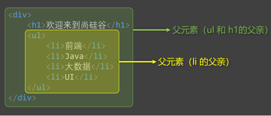
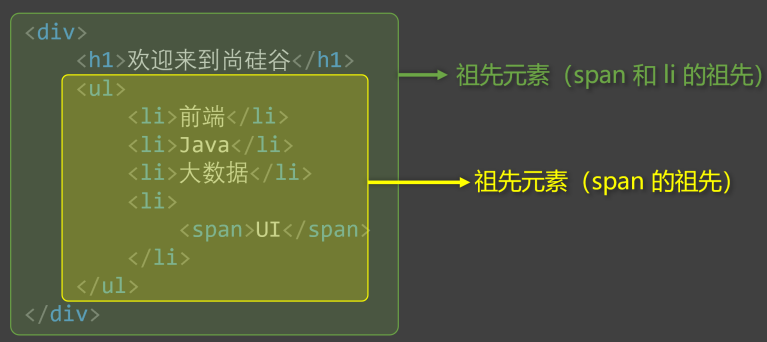
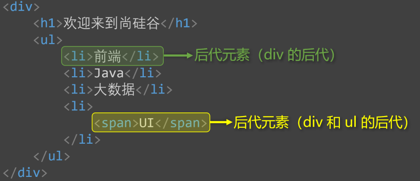
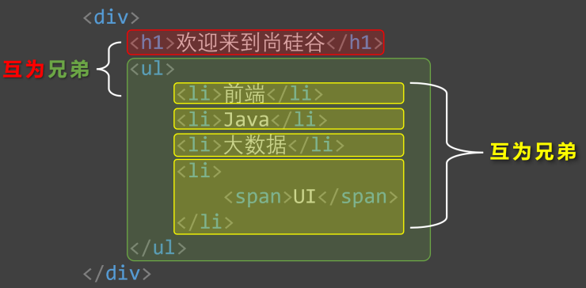
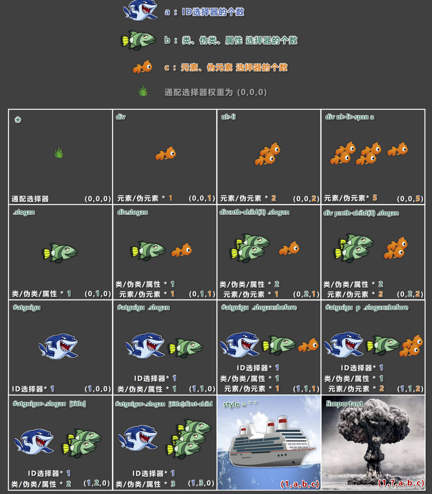

> [!WARNING] 想要下载本页为pdf？或者想要预览完整内容？
> 声明⚠️：作者已事先编辑好pdf文档，本文更新还在同步中……
> 
> 想要获取本文完整文档，[点击查看/下载CSS2完整笔记](/blog/tech_skills/CSS2笔记.pdf)，[点击查看/下载CSS3完整笔记](/blog/tech_skills/CSS3笔记.pdf)

# {{$frontmatter.title}}
## 1-简介
- `CSS` 全称为**层叠样式表**（`Cascading Style Sheets`）；
	- 层叠：一层一层“铺”上去；
	- 样式：文字大小、颜色、背景……；
	- 表：列表。
	- 如图所示： 
- `CSS` 也是一种标记语言，用于给 `HTML` 设置样式。
- `HTML` 搭建结构，`CSS` 添加样式，实现了**结构样式的分离**。
## 2-三种样式表
### 2.1-行内样式
- 写在空间标签的 `style` 属性中，又称内联样式。
```HTML
<h1 style="color:red;font-size=60px;">这是一个内联样式举例</h1>
```
- 效果前后对比
	- 前<h1>这是一个内联样式举例</h1>
	- 后<h1 style="color:red;font-size=60px;">这是一个内联样式举例</h1>
#### 注意点：
- **`HTML ` 的名值对是“名=值”；` CSS ` 的名值对是“名: 值;”；**
- 行内样式表，**只能控制当前标签**的样式，对其他标签无效。
#### 存在的问题：
- 不能复用；
- **没有体现结构与样式分离**；
- 可维护性差；
### 2.2-内部样式
- 写在 `HTML` 页面内部，将所有的 `CSS` 代码汇总，单独放在 `<style>` 标签内部；
```HTML
<style>
	h1 {
		color:red;
		font-size:60px;
	}
</style>
```
#### 注意点：
- `<style>` 标签理论上可以放在 `HTML` 文件的任意位置，但是**推荐放在 `<head>` 标签内部**；
#### 存在的问题：
- **没有完全实现样式与结构分离**；
- 同一个 `HTML` 文件内可以对样式进行复用，但是多个 `HTML` 文件无法复用样式。
#### 优势：
- 可以复用；
- 代码结构清晰。
### 2.3-外部样式
- 写在单独的 `.css` 文件中，随后在 `HTML` 文件中引入使用；
- 首先新建一个 `[css文件名称].css` 文件，并写入以下内容：
```css
h1 {
	color:red;
	font-size:60px;
}
```
- 再在 `HTML` 文件中引入该样式文件：
```HTML
<link rel="stylesheet" href="./[css文件名称].css">
```
#### 注意点：
- `<link>` 标签要写在 `<head>` 标签中；
- `<link>` 标签属性说明：
	- `href`：指明引入的文档位置；
	- `rel`：`relation` 的简写，说明引入的文档与当前文档的关系；
#### 优势：
- 可以复用；
- 代码结构清晰；
- 可触发浏览器的缓存机制，提高访问速度；
- 实现了**结构与样式的完全分离**；
- 是实际开发中最常使用的方式；
## 3-样式表优先级
- 优先级规则：行内样式 `>` 内部样式 `=` 外部样式
>[!TIP] 备注 
>1. 内部样式、外部样式，这两者的优先级相同，且：后面的会覆盖前面的（**后来居上**）
> 2. 同一个样式表中，优先级也和编写顺序有关，且：后面的会覆盖前面的 （**后来居上**）
> 3. “后来居上”前提是：同一种选择器。对不同种选择器之间，优先级规则详见 [选择器的优先级](CSS2#_3-选择器的优先级-权重)。
## 4-CSS 语法规范
### 4.1-样式写法
- *选择器*：找到要添加样式的元素；
- *声明块*：设置具体的样式（声明块是由一个或多个声明组成的），声明的格式为：**`属性名:属性值;`**；
> [!TIP] 备注
> 1. 最后一个声明后面的 `;` 理论上是可以省略的，推荐写上；
> 2. 选择器与声明块之间、属性名与属性值之间，均有一个空格，理论上可以省略，但推荐写上。


### 4.2-注释的写法
```css
/* 给h1元素添加样式 */
h1 {
	/* 设置文字颜色 */
	color:red;
	/* 设置文字大小 */
	font-size:60px;
}
```
## 5-CSS 代码风格
### 5.1-展开风格
- 开发时推荐，便于维护和调试
```css
h1 {
	color:red;
	font-size:60px;
}
```
### 5.2-紧凑风格
- 项目上线时推荐，可以减少文件体积
```css
h1 {color:red;font-size:60px;}
```
> [!TIP]备注
> 项目上线时，会使用工具 (`webpack`) 把【展开风格】的代码转换为【紧凑风格】的代码，这样可以减少文件体积，节约网络流量，同时也能让用户打开网页时速度更快。
# 二-CSS 选择器
## 1-CSS 基本选择器
### 1.1-通配选择器
- 作用：可以选中所有的 `HTML` 元素；
- 语法：
```css
* {
	属性明:属性值;
}
```
- 举例：
```css
/* 选中所有元素 */
* {
	color:orange;
	font-size:60px;
}
```
> [!TIP]备注
> 目前来看通配选择器几乎不使用，但在**清除样式时**，对我们有很大帮助。
### 1.2-元素选择器
- 作用：为页面中**某种元素**统一设置样式；
- 语法：
```css
标签名 {
	属性明:属性值;
}
```
- 举例：
```css
/* 选中所有h1元素 */
h1 {
	color:red;
	font-size:60px;
}
/* 选中所有p元素 */
p {
	color:red;
	font-size:60px;
}
```
>[!TIP]备注
>元素选择器无法实现**差异化设置**，譬如上面所示，所有 `p` 元素效果都一致。
### 1.3-类选择器
- 作用：根据元素的 `class` 值，来选中**这些**元素；
- 语法：
```css
.类名 {
	属性明:属性值;
}
```
- 举例：
```css
/* 选中所有class值为speak的元素 */
.speak {
	color:red;
	font-size:60px;
}
```
>[!TIP]备注
>1. 元素的 `class` 属性值不带 `.` ，但 `CSS` 类选择器要带 `.` 。
>2. `class` 值，是我们自定义的，按照标准：
>	- 不能使用纯数字、中文；
>	- 尽量使用数字和英文的组合；
>	- 若有多个单词组成，通过 `-` 连接，如：`left-menu`；
>	- 命名要做到**见名知意**；
>3. 一个元素不能写多个 `class` 属性，下面是错误示例：`<h1 class="speak" class="big">hello</h1>`; 同名属性不能重复，否则遵循后来居上原则。
>4. 一个元素的 `class` 可以有多个值，不同值之间用空格隔开：`<h1 class="speak big">hello</h1>`。
### 1.4-`id` 选择器
- 作用：根据元素的 `id` 属性值，来**精准**的选中**某个**元素；
- 语法：
```css
#id值 {
	属性明:属性值;
}
```
- 举例：
```css
/* 选中id值为earth的那个元素 */
#earth {
	color:red;
	font-size:60px;
}
```
>[!TIP]备注
>1. `id` 属性值，标准：
>	1. 尽量由字母、数字、下划线 (`_`)、短杠 (`-`)组成；
>	2. 以字母开头；
>	3. **不要包含空格**；
>	4. 区分大小写；
>2. 一个元素只能拥有一个 `id` 属性，多个元素的 `id` 属性值不能相同；
>3. 一个元素可以同时拥有 `id` 和 `class` 属性。
## 2-CSS 复合选择器
>[!NOTE] 什么是复合选择器？
> 1. 复合选择器建立在基本选择器基础上，由多个基础选择器通过不同方式组合而成；
> 2. 复合选择器可以在复杂结构中，快速而准确的选中元素。
### 2.1-交集选择器
- 作用：选中同时符合多个条件的元素。
> 交集有**并且**的意思，即：**既……又……**
- 语法：**选择器之间没有任何符号/空格**
```css
选择器1选择器2选择器3{
	属性名:属性值;
}
```
- 举例：
```css
/* 选中类名为beauty的p元素，为此种写法用的非常多 */
p.beauty{
	color:blue;
}
/* 选中类名包含rich和beauty的元素 */
.rich.beauty{
	color:red;
	font-size:60px;
}
```
> [!TIP]备注
> 1. **有标签名出现，标签名必须写在前面；**
> 2. `id` 选择器、通配选择器，理论上可以作为交集的条件，但实际应用中几乎不用——因为 `id` 唯一，通配包含全部，实际上没有意义；
> 3. 交集选择器中不可能出现两个元素选择器——因为一个元素只能是一种既定的类型；
> 4. 用的最多的交集选择器是：元素选择器配合类名选择器，例如：`p.beauty`。
### 2.2-并集选择器
- 作用：选中多个选择器对应的元素，又称：**分组选择器**
> 并集就是**或者**的意思，即：**要么……要么……**
- 语法：多个选择器通过 `,` 连接，此处 `,` 的含义就是**或**
```css
选择器1,
选择器2,
选择器3 {
	属性明:属性值;
}
```
- 举例：
```css
/* 选中id值为peiqi，或类名是rich，或类名为beauty的元素 */
#peiqi,
.rich,
.beauty {
	color:red;
	font-size:60px;
}
```
>[!TIP]备注
>1. 并集选择器我们一般竖着写；
>2. **任何形式的选择器**，都可以作为并集选择器的一部分；
>3. 并集选择器通常用于集体声明，可以缩小样式表体积。
### 2.3-HTML 元素之间的关系
- 分为：[父元素](CSS2#_2-3-1-父元素)、[子元素](CSS2#_2-3-2-子元素)、[祖先元素](CSS2#_2-3-3-祖先元素)、[后代元素](CSS2#_2-3-4-后代元素)、[兄弟元素](CSS2#_2-3-5-兄弟元素)
#### 2.3.1-父元素
- **直接**包裹某个元素的元素，就是该元素的父元素。
#### 2.3.2-子元素
- **被**父元素**直接**包裹的元素 (也称：儿子元素)。
#### 2.3.3-祖先元素
- 元素本身所有的外层元素，都是祖先。
#### 2.3.4-后代元素
- 元素本身所有的内层元素，都是后代。
#### 2.3.5-兄弟元素
- 父元素相同的元素，互为兄弟元素。
### 2.4-后代选择器
- 作用：选中指定元素中，符合要求的**后代元素**。
- 语法：多个选择器通过&nbsp ` ` &nbsp 连接，此处&nbsp ` ` &nbsp的含义就是**后代**，即"XXX 中的……"
```css
选择器1 选择器2 选择器3 {
	属性名:属性值;
}
```
- 举例：
```css
/* 选中ul中的所有li */
ul li {
	color:red;
}
/* 选中ul中所有li中的a */
ul li a {
	color:red;
}
/* 选中类名为subject的元素中的所有li */
.subject li {
	color:red;
}

/* 选中类名为subject的元素中的所有类名为front-end的li */
.subject .front-end li {
	color:red;
}
```
>[!TIP]备注
>1. 选择器可以是任意一种基本选择器的组合；
>2. 后代选择器最终选择的是后代，不选中祖先；
>3. 儿子、孙子、重孙子……都算是后代；
>4. 结构一定要符合之前讲的 `HTML` 嵌套要求，例如：不能 `p` 中写 `h1~h6`。（详见 [HTML 排版标签](../HTML/HTML4.md#_2、排版标签)）
### 2.5-子代选择器
- 作用：选中指定元素中，符合要求的**子元素**。
- 语法：
```css
选择器1>选择器2>选择器3……>选择器n {
	属性名:属性值;
}
```
- 举例：
```css
/* div中的子代a元素 */
div>a {
	color:red;
}
/* 类名为person的元素中的子代a元素 */
.person>a {
	color:red;
}
```
>[!TIP]备注
>1. 子代选择器最终选择的是子代，不是父级；
>2. 选择器可以是任意一种基本选择器的组合；
>3. 儿子、孙子、重孙子……都算是后代，**子就是指儿子**。
### 2.6-兄弟选择器
#### 2.6.1-相邻兄弟选择器
- 作用：选中指定元素后，符合条件的**相邻兄弟**元素。（tip：**睡在我**下铺**的兄弟**）
- 语法：
```css
选择器1+选择器2 {
	属性名:属性值;
}
```
- 举例：
```css
/* 选中div后相邻的兄弟p元素 */
div+p {
	color:red;
}
```
#### 2.6.2-通用兄弟选择器
- 作用：选中指定元素后，符合条件的**所有兄弟**元素。（tip：**睡在我**下铺**的**所有**兄弟**
- 语法：
```css
选择器1~选择器2 {
	属性名:属性值;
}
```
- 举例：
```css
/* 选中div后所有的兄弟p元素 */
div~p {
	color:red;
}
```
>[!TIP]备注
>1. 两种兄弟选择器，选择的都是**下面**的兄弟。
>2. 选择器可以使用任意基本选择器进行搭配。
### 2.7-属性选择器
- 作用：选中属性值符合一定要求的元素。
- 语法：
```css
1.[属性名]：选中【具有】某个属性的元素；
2.[属性名="值"]：选中包含某个属性，且属性值【等于】指定值的元素
3.[属性名^="值"]：选中包含某个属性，且属性值以指定值【开头】的元素
4.[属性名$="值"]：选中包含某个属性，且属性值以指定值【结尾】的元素
5.[属性名*="值"]：选中包含某个属性，且属性值【包含】指定值的元素
```
- 举例：
```css
/* 选中具有title属性的元素 */
[title] {color:red;}

/* 选中title属性值为atguigu的元素 */
[title="atguigu"] {color:red;}

/* 选中title属性值以a开头的元素 */
[title^="a"] {color:red;}

/* 选中title属性值以u结尾的元素 */
[title$="u"] {color:red;}

/* 选中title属性值包含g的元素 */
[title*="g"] {color:red;}
```
### 2.8-伪类选择器
- 作用：选中**特殊状态**的元素。
>[!NOTE] 什么是“伪”？什么是“伪类”？
>1. “伪”即虚假的；
>2. “伪类”即像类(`class`)，但不是类，是元素的一种特殊状态。
#### 2.8.1-动态伪类
1. `:link` 超链接**未被访问**的状态；
2. `:visited` 超链接**被访问过**的状态；
3. `:hover` 鼠标**悬停**在元素上的状态；
4. `:active` 元素**激活后**的状态。
>什么是激活？
>- 即按下鼠标不松开。
>- ⚠️注意点：在 `<style></style>` 标签中编写时要遵循 `LVHA` 的顺序，即 `link`、`visited`、`hover`、`active`。
5. `:focus` 获取焦点的元素。
> 注意
>- 表单类元素才能使用 `:focus` 伪类；
>- 当用户点击元素、触摸元素、或通过键盘 `tab` 键等方式选择元素时，就是获得焦点。
- 示例：
```HTML
<!DOCTYPE html>
<html lang="zh-CN">
<head>
	<style>
		a:link {color:red;}
		a:visited {color:purple}
		a:hover {color:blue}
		a:active {color:gray}
		input:focus,
		select:focus {
			color:red;
			background-color:green;
		}
	</style>
</head>
<body>
	<a href="www.baidu.com">去百度</a>
	<input type="text">
	<select>
		<option value="1">1</option>
		<option value="2">2</option>
		<option value="3">3</option>
	</select>
</body>
</html>
```
#### 2.8.2-结构伪类
- 常用的：
	1. `:first-child` 所有兄弟元素中的**第一个**
	2. `:last-child` 所有兄弟元素中的**最后一个**
	3. `:nth-child(n)` 所有兄弟元素中的**第 n 个**
	4. `:first-of-type` 所有**同类型**兄弟元素中的**第一个**
	5. `:last-of-type` 所有**同类型**兄弟元素中的**最后一个**
	6. `:nth-of-type(n)` 所有**同类型**兄弟元素中的**第 n 个**

>[!NOTE] 关于 n 的值
>1. `0` 或 `不写`：什么都不选（几乎不用）；
>2. `n`：选中所有子元素（几乎不用）；
>3. `1~正无穷的整数`：选中对应序号的子元素；
>4. `2n` 或 `even`：选中序号为偶数的子元素；
>5. `2n+1` 或 `odd`：选中序号为奇数的子元素；
>6. `-n+3`：选中前 3 个；
>7. **必须是 `an+b` 的形式**。
- 不常用的：
	1. `:nth-last-child(n)` 所有兄弟元素中的**倒数第 n 个**
	2. `:nth-last-of-type(n)` 所有**同类型**兄弟元素中的**倒数第 n 个**
	3. `:only-child` 选择**没有兄弟**的元素（独生子女）
	4. `:only-of-type` 选择**没有同类型兄弟**的元素
	5. `:root` 根元素
	6. `:empty` 内容为空元素（空格也算内容）
#### 2.8.3-否定伪类
- `:not(选择器)` **排除**满足括号中条件的元素。
>[!TIP]备注
>- 选择器可以是任意基本选择器
#### 2.8.4-UI伪类
1. `:checked` 被选中的复选框或者单选按钮
2. `:enable` 可用的表单元素（没有 `disabled` 属性）
3. `:disabled` 不可用的表单元素（有 `disabled` 属性）
- 主要用于 `<input>` 标签中，举例：
```html
<input type="radio">//1
<input type="checkbox">//2
<input type="text" disabled>//3
<input type="text">//4

<style>
	input:disabled {color:red;}/* 3变红 */
	input:checked {width:60px;height:60px}/* 若1、2被勾选，那么变大变宽，注意 颜色样式 对radio、checkbox没有作用 */
</style>
```
#### 2.8.5-目标伪类-了解
- `:target` 选中锚点指向的元素。
#### 2.8.6-语言伪类-了解
- `:lang()` 根据指定的语言选择元素（本质是看 `lang` 属性的值）。
### 2.9-伪元素选择器
- 作用：选中元素中的一些特殊位置。
- 常用伪元素：
	- `::first-letter` 选中元素中的第一个文字
	- `::first-line` 选中元素中的第一行文字
	- `::selection` 选中被鼠标选中的内容
	- `::placeholder` 选中输入框的提示文字
	- `::before` 在元素之前创建一个子元素
	- `::after` 在元素之后创建一个子元素
## 3-选择器的优先级-权重
> 当对同一元素的**同一样式**使用**不同选择器**设置**不同值**时，就会产生样式冲突，此时由选**择器优先级**决定元素的样式。
### 3.1-简单描述
>行内样式 `>` ID 选择器 `>` 类选择器 `>` 元素选择器 `>` 通配选择器；
> `!important`：在属性键值对后加 `!important` 的权重，**大于行内样式**。
### 3.2-详细描述
- 计算方式：每个选择器，都可以计算出一组权重，格式为 `(a, b, c)`。
> `a`：**ID** 选择器的个数；
> `b`：**类**、**伪类**、**属性**选择器的个数；
> `c`：**元素**、**伪元素**选择器的个数。

|            选择器             |    权重     |
| :------------------------: | :-------: |
|          `ul>li`           | `(0,0,2)` |
|    `div ul>li p a span`    | `(0,0,6)` |
|     `#atguigu .slogan`     | `(1,1,0)` |
|    `#atguigu .slogan a`    | `(1,1,1)` |
| `#atguigu .slogan a:hover` | `(1,2,1)` |
- 比较规则：按照从左到右的顺序，依次比较大小，从当前位胜出后，后面的不再参与对比。
- 图示 
# 三-CSS 三大特性
