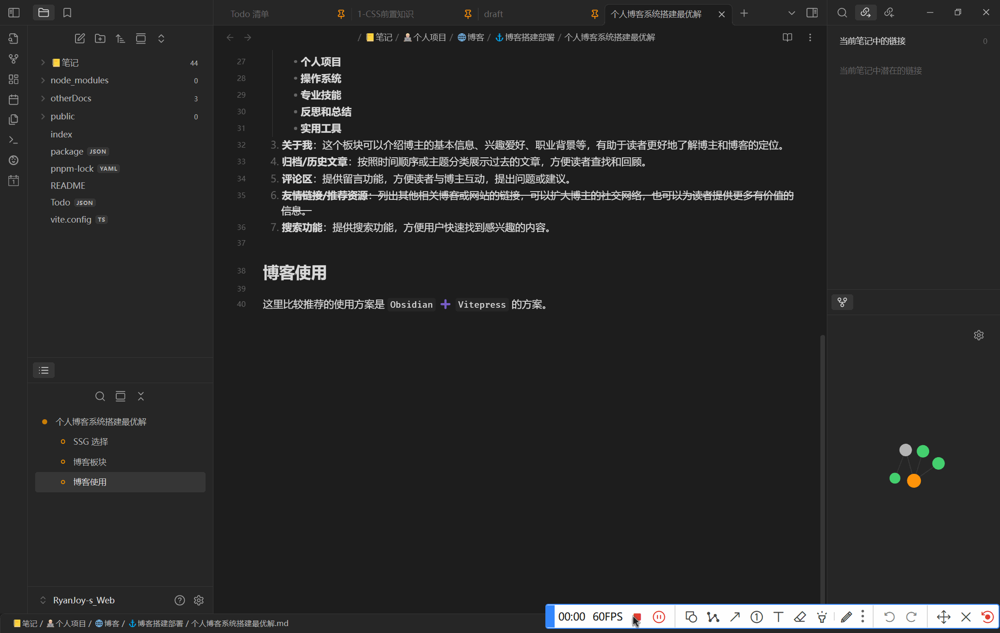
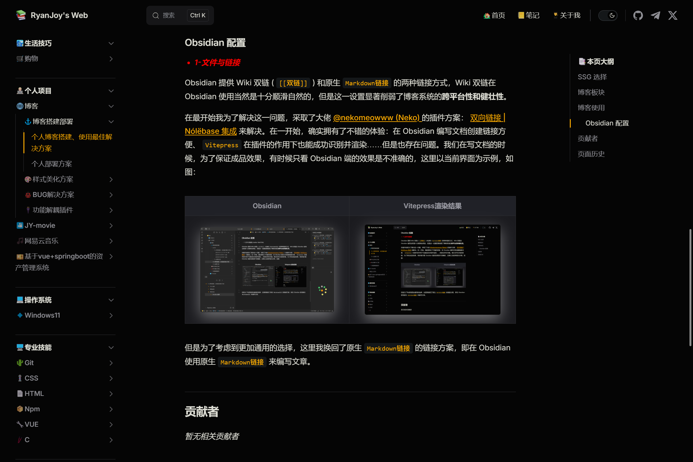
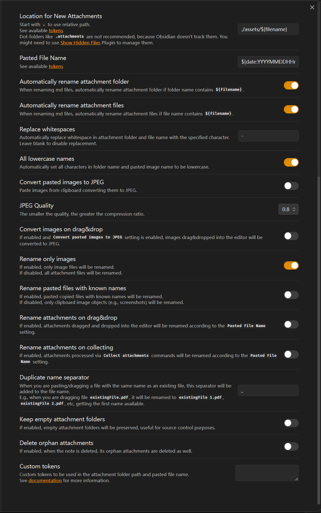
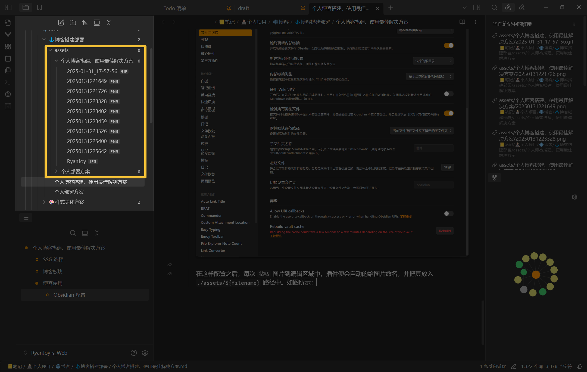
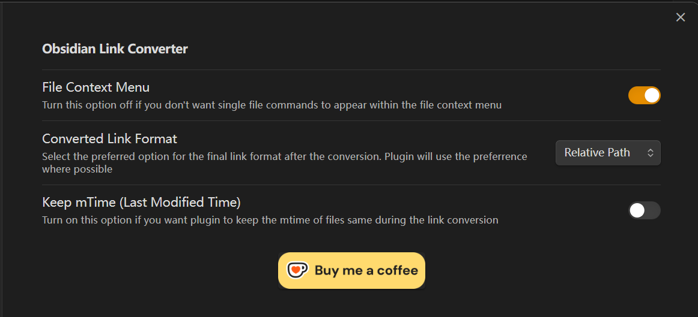
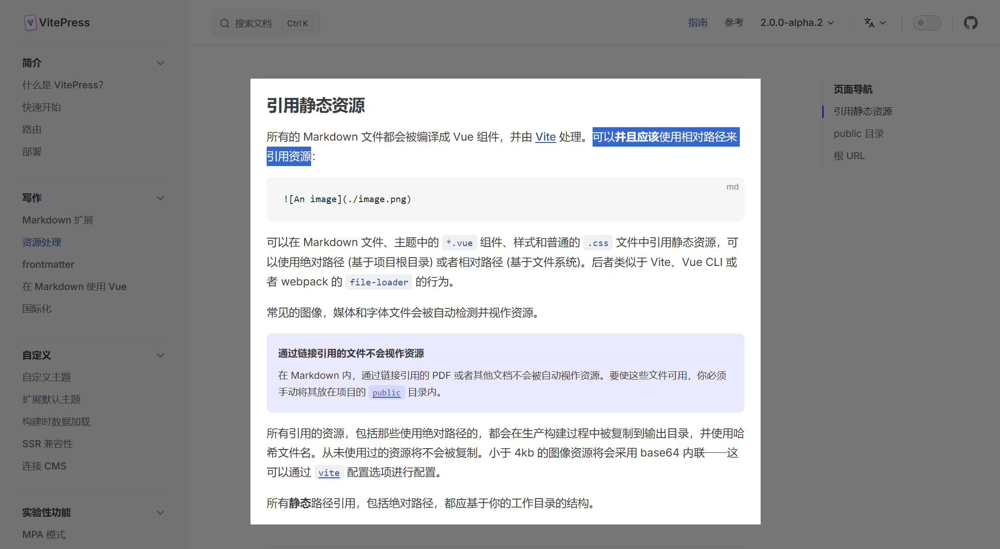
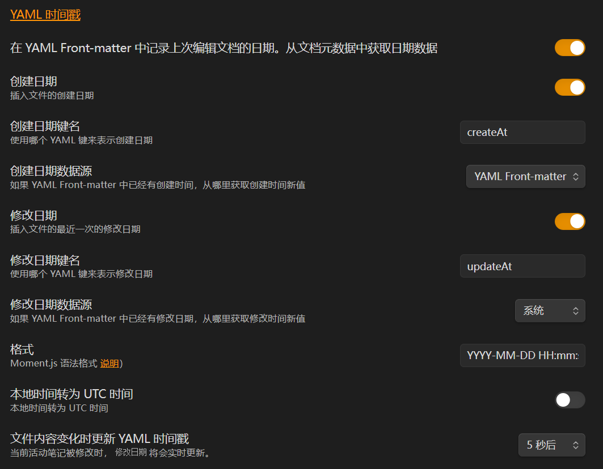

# 个人博客搭建、使用最佳解决方案

## SSG 选择

目前用户较多的有 [Hexo](https://hexo.io/zh-cn/)，[Hugo](https://gohugo.io/)，[Gatsby](https://www.gatsbyjs.com/)，[VuePress](https://vuepress.vuejs.org/zh/)，[VitePress](https://vitepress.dev/zh/)，[Jekyll](https://jekyllrb.com/)。另外还有 [Pelican](https://getpelican.com/)，[Middleman](https://middlemanapp.com/)，[MkDocs](https://www.mkdocs.org/)，[docsify](https://docsify.js.org/#/) ，[GitBook](https://www.gitbook.com/)等……

毫无疑问，如果你正在看这篇文档，说明你和我刚开始搭建博客时有一样的忧虑。

### 主流生成器汇总对比

下面给出一些<span class="marker-evy">主流生成器</span>在我**主观层面的对比分析**：

| 工具                  | 优点                                                                                                                  | 缺点                                                                      |
| ------------------- | ------------------------------------------------------------------------------------------------------------------- | ----------------------------------------------------------------------- |
| **Hexo**            | - 基于 Node. js，安装部署较方便<br>- 插件和主题丰富，社区活跃，适合博客和个人站点                                                                   | - 构建速度较慢，随着内容增多可能下降<br>- 依赖 Node 生态，部分插件维护不够活跃，升级时可能遇到兼容性问题             |
| **Hugo**            | - 极速构建，超快速度（Go 语言驱动）<br>- 单二进制文件，部署简单- 内置丰富功能，适合大规模内容网站                                                             | - 主题较少<br>- 模板语法较特殊，学习成本较高<br>- 部分高级定制需求可能受到框架限制                        |
| **Gatsby**          | - 基于 React，适合构建复杂应用<br>- 丰富的插件系统和 GraphQL 数据层<br>- 支持 PWA、图像优化等特性                                                   | - 构建速度慢，内容多时性能可能成为瓶颈<br>- 配置复杂，学习曲线陡峭，需要熟悉 React 和 GraphQL              |
| **VuePress**        | - 以 Vue 为核心，配置简单，专注于文档站点<br>- 默认主题简洁美观，支持热重载<br>- Markdown 与 Vue 组件无缝结合                                             | - V1 版本构建速度较慢<br>- 功能主要面向文档，复杂网站可能不够灵活<br>- 社区插件和生态相对 Gatsby 等略逊        |
| **`VitePress`**     | - 基于 Vite 和 Vue 3，极速开发体验（快速 HMR，启动速度快）<br>- 体积轻量、配置简单，适合文档和博客站点<br>- 内置 Markdown 支持，可嵌入 Vue 组件，优化文档阅读体验<br>- 现代化技术栈 | - 插件生态尚在初期，扩展和高级需求可能需自行开发<br>- 主题定制成本较高，定制化能力受限<br>- 社区规模较小，官方文档和案例尚不丰富 |
| **Jekyll**          | - 深度整合 GitHub Pages，官方支持<br>- 社区成熟，插件丰富<br>- 适合博客和文档站点                                                              | - 依赖 Ruby 环境，对初学者不够友好<br>- 当内容较多时构建速度较慢                                 |
| **Pelican**         | - 基于 Python，适合 Python 开发者<br>- 支持 Markdown 与 reStructuredText，灵活性较高                                                 | - 主题和插件资源较少<br>- 社区活跃度较低                                                |
| **Middleman**       | - 灵活定制，适合开发个性化网站<br>- 依托 Ruby 生态，有较强的定制能力                                                                           | - 相对过时，社区活跃度低<br>- 需要对 Ruby 环境有较深入了解，入门门槛较高                             |
| **MkDocs**          | - 专注文档站点，配置简单，易于上手<br>- 基于 Python 开发，内置美观主题和搜索功能                                                                    | - 功能较为单一，不适合博客或复杂网站<br>- 定制化程度有限                                        |
| **docsify**         | - 无需预生成静态 HTML，直接在浏览器中渲染 Markdown<br>- 上手简单，零构建步骤，适合轻量级文档展示                                                         | - 客户端渲染对 SEO 不友好<br>- 大型项目首屏加载可能存在性能问题                                  |
| **GitBook**         | - 专注于交互式文档编写与团队协作，在线编辑体验好<br>- 集成版本控制与多人协作工具                                                                        | - 商业化转型后开源功能受限，部分功能收费                                                   |
| **Docusaurus**      | - 基于 React，专注于开源文档和博客<br>- 内置多语言和版本控制支持，社区活跃，适合项目文档                                                                 | - 默认风格固定，定制成本较高<br>- 对于非 React 开发者来说，上手可能存在一定门槛                         |
| **Sphinx**          | - 技术文档标准工具，支持 LaTeX 排版                                                                                              | - 配置复杂，学习曲线陡峭                                                           |
| **Eleventy (11ty)** | - 无框架依赖，灵活轻量- 支持多种模板语言（如 Nunjucks、Liquid、Handlebars 等），构建速度快，配置自由度高- 社区发展迅速                                         | - 需要自行整合工具链<br>- 生态尚在完善，部分高级功能需自行开发- 对初学者来说可能因过于自由而增加学习曲线               |
| **Next.js**         | - 同时支持静态生成与服务端渲染，灵活性极高- 基于 React，生态系统完善- 适合构建复杂、交互丰富的网站                                                             | - 配置较复杂，学习曲线陡峭<br>- 对于纯静态站点来说可能显得臃肿                                     |
| **Nuxt.js**         | - 基于 Vue，支持 SSR 和 SSG，配置友好<br>- 社区活跃、文档完善<br>- 适合 Vue 用户构建复杂站点                                                      | - 对于仅需简单静态站点的项目可能过于复杂<br>- 高定制需求时插件配置和管理较复杂                             |
| **Zola**            | - 基于 Rust，构建速度极快<br>- 部署简单，仅需一个二进制文件<br>- 适合对性能和构建效率要求极高的项目                                                         | - 生态较小，插件和模板资源有限<br>- 模板和功能较为基础，高级定制可能需要自行扩展                            |
| **Metalsmith**      | - 极简核心，完全依赖插件实现功能，灵活可定制<br>- 适合需要精细控制构建过程的开发者                                                                       | - 插件配置和管理较繁琐<br>- 相较于现代工具，生态和文档支持可能不足                                   |
| **Astro**           | - 组件化设计，支持混合使用多种前端框架<br>- 面向现代 Web 开发趋势                                                                             | - 概念较新，文档和案例仍需进一步完善                                                     |

### 感到十分头疼不知作何选择 ？感到花样太多难以做出决定？

我在上述表格的基础上，删除了具有以下特点的生成器：

- 用户人数少；
- 社区不活跃；
- 技术相对不新颖；

那么相对而言，较为优选的生成器就汇总出来了

| 工具              | 优点                                                                                                                  | 缺点                                                                        |
| --------------- | ------------------------------------------------------------------------------------------------------------------- | ------------------------------------------------------------------------- |
| **Hexo**        | - 基于 Node.js，安装部署较方便<br>- 插件和主题丰富，社区活跃，适合博客和个人站点                                                                    | - 构建速度较慢，内容增多时可能下降<br>- 部分插件维护不够活跃，升级时可能遇到兼容性问题                           |
| **Hugo**        | - 极速构建（Go 语言驱动）<br>- 单二进制文件，部署简单<br>- 内置丰富功能，适合大规模内容网站                                                              | - 主题较少<br>- 模板语法特殊，上手学习成本较高<br>- 部分高级定制需求可能受到框架限制                         |
| **Gatsby**      | - 基于 React，适合构建复杂应用<br>- 丰富的插件系统和 GraphQL 数据层<br>- 支持 PWA、图像优化等特性                                                   | - 构建速度慢，内容多时性能可能成为瓶颈<br>- 配置复杂，学习曲线陡峭，需要熟悉 React 和 GraphQL                |
| **VuePress**    | - 以 Vue 为核心，配置简单，专注于文档站点<br>- 默认主题简洁美观，支持热重载<br>- Markdown 与 Vue 组件无缝结合                                             | - V1 构建速度较慢<br>- 功能主要面向文档，复杂网站可能不够灵活<br>- 社区插件和生态相对 Gatsby 等略逊            |
| **`VitePress`** | - 基于 Vite 和 Vue 3，极速开发体验（快速 HMR，启动速度快）<br>- 体积轻量、配置简单，适合文档和博客站点<br>- 内置 Markdown 支持，可嵌入 Vue 组件，优化文档阅读体验<br>- 现代化技术栈 | - 插件生态尚处初期，扩展和高级需求可能需自行开发<br>- 主题定制成本较高，定制化能力受限<br>- 社区规模相对较小，相关案例和资料仍在积累 |
| **Jekyll**      | - 深度整合 GitHub Pages，官方支持<br>- 社区成熟，插件丰富，适合博客和文档站点                                                                   | - 依赖 Ruby 环境，对初学者可能不够友好<br>- 当内容较多时构建速度较慢                                 |
| **Docusaurus**  | - 基于 React，专注于开源文档和博客<br>- 内置多语言和版本控制支持，适合项目文档<br>- 社区活跃、维护良好                                                       | - 默认风格固定，定制成本较高<br>- 对非 React 开发者来说，上手可能存在一定门槛                            |
| **Eleventy**    | - 无框架依赖，灵活轻量<br>- 支持多种模板语言（如 Nunjucks、Liquid、Handlebars 等），构建速度快，配置自由度高<br>- 社区发展迅速                                 | - 需要自行整合工具链<br>- 生态尚在完善，部分高级功能需自行开发<br>- 对初学者来说可能因过于自由而增加学习曲线             |
| **Next.js**     | - 同时支持静态生成与服务端渲染，灵活性极高<br>- 基于 React，生态系统完善<br>- 适合构建复杂、交互丰富的网站                                                     | - 配置较复杂，学习曲线陡峭<br>- 对于单纯的静态站点来说可能显得臃肿                                     |
| **Nuxt.js**     | - 基于 Vue，支持 SSR 与 SSG，配置友好<br>- 社区活跃、文档完善<br>- 适合 Vue 用户构建复杂站点                                                      | - 对于仅需简单静态站点的项目可能显得复杂<br>- 高定制需求时插件配置和管理可能较为繁琐                            |
| **Astro**       | - 组件化设计，支持混合使用多种前端框架<br>- 面向现代 Web 开发趋势，适合构建性能优异的静态站点                                                               | - 概念较新，部分文档和案例仍需进一步完善                                                     |

### 进一步贴切——文档性站点需求

考虑到所谓「博客」也是文字性内容居多，对于 **样式、美化** 我相信不是我们博客人做电子笔记或者说电子书的初心所在。

所以，这里进一步筛选出定位在「文档性站点」的生成器。{.marker-underline}

| 工具              | 优点                                                                                                                  | 缺点                                                                        |
| --------------- | ------------------------------------------------------------------------------------------------------------------- | ------------------------------------------------------------------------- |
| **VuePress**    | - 以 Vue 为核心，配置简单，专注于文档站点<br>- 默认主题简洁美观，支持热重载<br>- Markdown 与 Vue 组件无缝结合                                             | - V1 构建速度较慢<br>- 功能主要面向文档，复杂网站可能不够灵活<br>- 社区插件和生态相对 Gatsby 等略逊            |
| **`VitePress`** | - 基于 Vite 和 Vue 3，极速开发体验（快速 HMR，启动速度快）<br>- 体积轻量、配置简单，适合文档和博客站点<br>- 内置 Markdown 支持，可嵌入 Vue 组件，优化文档阅读体验<br>- 现代化技术栈 | - 插件生态尚处初期，扩展和高级需求可能需自行开发<br>- 主题定制成本较高，定制化能力受限<br>- 社区规模相对较小，相关案例和资料仍在积累 |
| **Jekyll**      | - 深度整合 GitHub Pages，官方支持<br>- 社区成熟，插件丰富，适合博客和文档站点                                                                   | - 依赖 Ruby 环境，对初学者可能不够友好<br>- 当内容较多时构建速度较慢                                 |
| **Docusaurus**  | - 基于 React，专注于开源文档和博客<br>- 内置多语言和版本控制支持，适合项目文档<br>- 社区活跃、维护良好                                                       | - 默认风格固定，定制成本较高<br>- 对非 React 开发者来说，上手可能存在一定门槛                            |

### 最终方案敲定

在这里呢，显而易见我的选择是 `VitePress` ，吸引我的地方：一是它样式较为正式，颇具「项目说明书」「Wiki 文档」「使用手册」「项目文书」这样的特点；二是结构简单，布局清晰；三是用户群体愈来愈多，方便交流。

当然，有可能你很喜欢「精美的样式」、「炫酷的动效」、「高度自定义的主题」、「别具一格的站点风格」，那么 `Vitepress` 一定不是你的最终选择。

为了帮你快速做出抉择，这里给出以下推荐：

1. **新手入门**：从 **Hexo/Jekyll** 开始，依赖成熟生态降低学习成本。
2. **文档优先**：
    - Vue 技术栈选 **VitePress**
    - React 技术栈选 **Docusaurus**
    - Python 项目选 **MkDocs/Sphinx**。
3. **企业级应用**：结合框架能力（如 **Nuxt.js / Next.js**) 和 Headless CMS
4. **极简主义**：追求构建速度用 **Hugo/Zola**，灵活性用 **Eleventy**
5. **交互丰富站点**：**Gatsby**（React）或 **Astro**（混合框架）。

相信上述内容一定对你的博客搭建技术选型有所帮助，选择你喜欢的进行第一次搭建吧！

::: tip 一些忠告
博客，重点是内容产出，至于真正选什么生成器都是次要的，多看一些私人博客站点，你自会有所抉择。
:::

## 博客板块设置

1. **🏠首页**：这是用户访问博客时首先看到的页面。它应该包含博客的基本介绍、分类导航以及关于博主或博客的简要介绍。
2. **📒文章**：这是博客系统的核心板块，用于展示博主的文章。可以进一步细分为不同的分类或标签，方便用户根据兴趣浏览。
	- **生活技能**
	- **个人项目**
	- **操作系统**
	- **专业技能**
	- **反思和总结**
	- **实用工具**
3. **关于我**：这个板块可以介绍博主的基本信息、兴趣爱好、职业背景等，有助于读者更好地了解博主和博客的定位。
4. **归档/历史文章**：按照时间顺序或主题分类展示过去的文章，方便读者查找和回顾。
5. **评论区**：提供留言功能，方便读者与博主互动，提出问题或建议。
6. ~~**友情链接/推荐资源**：列出其他相关博客或网站的链接，可以扩大博主的社交网络，也可以为读者提供更多有价值的信息。~~
7. **搜索功能**：提供搜索功能，方便用户快速找到感兴趣的内容。

## 博客使用

这里比较推荐的使用方案是 `Obsidian` ➕ `Vitepress` 的方案。例如我现在在这里进行文档编写，在 VScode 里面进行版本控制和代码提交。



这里的使用方案也是我在踩了无数的坑、重构了无数次博客布局后摸索出来的，下面给大家做一下分享。

### Obsidian配置

#### 文件与链接

Obsidian 提供 Wiki 双链 ( `[[双链]]` ) 和原生 `Markdown链接` 的两种链接方式，Wiki 双链在 Obsidian 使用当然是十分顺滑自然的，但是这一设置显著削弱了博客系统的**跨平台性和健壮性**。

在最开始我为了解决这一问题，采取了大佬 [@nekomeowww (Neko)](https://github.com/nekomeowww) 的插件方案： [双向链接 \| Nólëbase 集成](https://nolebase-integrations.ayaka.io/pages/zh-CN/integrations/markdown-it-bi-directional-links/) 来解决。在一开始，确实拥有了不错的体验：

- 在 Obsidian 编写文档创建链接方便；
- `Vitepress` 在插件的作用下也能成功识别并渲染
- ……

<span class="marker-evy">但是也存在问题</span>。

我们在写文档的时候，为了保证成品效果，有时候只看 Obsidian 端的效果是不准确的，这里以当前界面为示例，如图：

|                  **Obsidian**                  |               **Vitepress**渲染结果                |
| :--------------------------------------------: | :--------------------------------------------: |
|  |  |

所以我们会不停的切换到浏览器页面查看前端渲染完成的效果。{.marker-underline}

但这就引出了前文提到的问题： [双向链接 \| Nólëbase 集成](https://nolebase-integrations.ayaka.io/pages/zh-CN/integrations/markdown-it-bi-directional-links/) 查看方案只能保证 `Vitepress` 在部署到服务器上以后我们看到的链接引用是正确的，但是如果我们直接在 `Markdown` 文档中使用 `![[]]` 写法，只会在 Obsidian 端看到效果，而前端 `dev` 界面未能成功渲染。如图所示：

| **引用方式**                                  |                  **Obsidian**                  |               `Vitepress` 前端 DEV               |
| ----------------------------------------- | :--------------------------------------------: | :--------------------------------------------: |
| `![[assets/个人博客搭建、使用最佳解决方案/RyanJoy.jpg]]` |  |  |
| `` |  |  |

所以为了考虑到更加适合开发的情形，这里我换回了原生 `Markdown链接` 的方案。{.marker-fakeTitle}

在此基础之上，为了优化开发体验、增强博客系统健壮性，这里又增添了几个插件：

- [Custom Attachment Location]( obsidian://show-plugin?id=obsidian-custom-attachment-location )：一个自动修改附件名称、存储位置的插件。

	插件配置如下：

	

	系统配置如下：

	

	在这样配置之后，每次 `粘贴` 图片到编辑区域中，插件便会自动的给图片命名，并把其放入 `./assets/${filename}` 路径中。如图所示：

	

	安装之后，「已经存在的图片」不会自动被处理。如果你希望全部图片都按照上述图片所示的结构存储，执行以下步骤：

	1. 在 Obsidian 编辑页面，按 `Ctrl+p` ，换出命令面板；
	2. 在命令面板输入 `custom attachment location` ，出现选项：

		

		第一个是只对**当前文件**的附件进行自动化处理；第二个是对**整个仓库**的附件进行自动化处理；第三个是对**当前文件所在文件夹**的附件进行自动化处理。选择你想要处理的范围即可。

		**这里我直接选了第二个。**

		::: warning 注意！！！

		数据无价！记得提前备份再进行操作！

		:::

		执行第二个命令之后，会发现原本存储图片的位置已经自动清除，现在所有图片已经被移动到 <span class="marker-evy">**指定配置**</span> 的位置

	3. 后续就基本不再会使用「步骤 2」的命令了，你`粘贴`的图片会自动被处理。

- [Obsidian Link Converter]( obsidian://show-plugin?id=obsidian-link-converter )：一个自动扫描全局链接的插件，把原本链接转化为你所指定的形式。

	插件配置如下：

	

	这一插件主要用来辅助 [Custom Attachment Location](obsidian://show-plugin?id=obsidian-custom-attachment-location) 插件的使用。在经过 [Custom Attachment Location](obsidian://show-plugin?id=obsidian-custom-attachment-location) 的命令之后，所有附件被移动到当前文件的父文件夹下，毫无疑问此位置更适合使用相对路径， `Vitepress` [官方文档](https://vitepress.dev/zh/guide/asset-handling#referencing-static-assets) 也是这么建议我们的：

	

	因此我们可以利用这一插件进行全局链接的转换，步骤如下：

	1. 在 Obsidian 编辑页面，按 `Ctrl+p` ，换出命令面板；
	2. 在控制面板输入 `Link Converter` ，弹出窗口显示如下：

		

		选择第二个。

	3. 等待命令执行完毕即可。

#### 文件配置

每一份文件都需要增加 `frontmatter` 项，基本内容如下：

```markdown [example.md]
---
title:  文章标题
createAt:  YYYY-MM-DD HH:mm:ss
updateAt:  YYYY-MM-DD HH:mm:ss
---
```

这一配置不仅能够显示文档的历史，也为 [Vitepress自动生成索引页](../🔌功能解耦插件/Vitepress自动生成索引页.md) 提供了方便。这一配置也可以通过插件实现，这里推荐 [Linter](obsidian://show-plugin?id=obsidian-linter) 。插件时间戳配置如下：



其余默认设置即可。这样你每次创建文件、编辑文件便会自动更新 `frontmatter` 中的键值对。

### 文档编写

在经过了 [Obsidian 配置](#obsidian配置) 之后，你就能够按照我的开发模式进行文档撰写了。

主要开发任务分配给 Obsidian，项目版本控制交给 VScode，并通过浏览器查看 Vitepress 渲染结果。这是一个十分自然的开发过程，快去开启你的愉快探索吧！

## 🎊写在最后

可能说「最佳」确实有些标题党，但是不可否认的是，这确实是我体验下来最舒服的书写体验。良好的书写工具和环境无疑会促进你的输出，我个人对现在的状态还是比较满意的。

如果您对此篇有所建议，欢迎评论留言；如果您愿意贡献此篇，欢迎点击页面右上角 Github 图标，到本仓库提出 `PR` 。