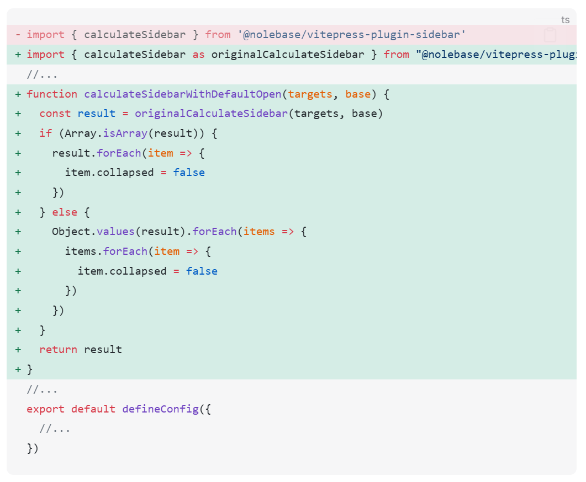
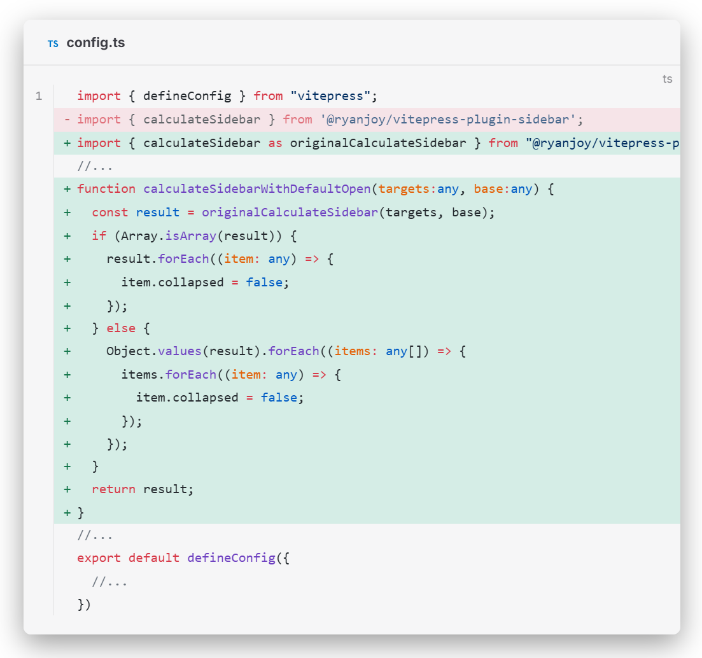

# Vitepress代码块(组)美化方案

## 效果展示

|               Vitepress 原生               |                   美化后                    |
| :--------------------------------------: | :--------------------------------------: |
|  |  |

## 配置

这里需要新增三个代码文件：[代码块美化](#代码块美化)、[代码组美化](#代码组美化)、[代码块组带标题](#代码块组带标题)

### 新增-代码块美化

在 `📂:.vitepress/theme/style` 下创建 `📄:vp-code.css` ，内容如下

```css [vp-code.css]
/* .vitepress/theme/style/vp-code.css */

.vp-doc div[class*=language-] {
  box-shadow: var(--custom-shadow); /* [!code warning] */
}
.vp-doc .line-numbers-wrapper {
  padding-top: 20px;
  border-right: none;
}
.vp-doc .line-numbers-wrapper::after {
  content: "";
  position: absolute;
  top: 20px;
  right: 0;
  border-right: 1px solid var(--vp-code-block-divider-color);
  height: calc(100% - 40px);
}
.vp-doc div[class*='language-'].line-numbers-mode {
  margin-bottom: 20px;
}
```

### 新增-代码组美化

在 `📂:.vitepress/theme/style` 下创建 `📄:vp-code-group.css` ，内容如下

```css [vp-code-group.css]
/* .vitepress/theme/style/vp-code-group.css */

.vp-code-group {
    color: var(--vp-c-black-soft);
    border-radius: 8px;
    box-shadow: var(--custom-shadow); /* [!code warning] */
}
.vp-code-group div[class*="language-"].vp-adaptive-theme.line-numbers-mode {
    border-radius: 8px;
    box-shadow: none;
    padding-top: 0px;
}
.vp-code-group div[class*="language-"].vp-adaptive-theme.line-numbers-mode::before {
    display: none;
}
.vp-code-group .line-numbers-mode .line-numbers-wrapper {
    padding-top: 20px;
}
.vp-code-group .line-numbers-mode .line-numbers-wrapper::after {
    top: 24px;
    height: calc(100% - 45px);
}
.vp-code-group div[class*="language-"].vp-adaptive-theme {
    border-radius: 8px;
    box-shadow: none;
    padding-top: 0px;
}
.vp-code-group div[class*="language-"].vp-adaptive-theme::before {
    display: none;
}
```

### 新增-含标题代码块组

::: warning 前提操作
配置 [Vitepress 代码块显示 icon 方案](../🔌功能解耦插件/Vitepress代码块icon.md)
:::

在 `📂:.vitepress/theme/style` 下创建 `📄:vp-code-title.css` ，内容如下

```css [vp-code-title.css]
/* .vitepress/theme/style/vp-code-title.css */

.vp-code-block-title {
    background-color: var(--vp-code-block-bg);
    margin-bottom: 20px;
    border-radius: 8px;
    box-shadow: var(--custom-shadow); /* [!code warning] */
    position: relative;
}
.vp-code-block-title .vp-code-block-title-bar {
    color: var(--vp-c-text-1);
    font-size: 14px;
    font-weight: bold;
}
.vp-code-block-title div[class*="language-"].vp-adaptive-theme.line-numbers-mode {
    border-radius: 8px;
    box-shadow: none;
    padding-top: 0px;
    margin-bottom: 0px;
}
.vp-code-block-title div[class*="language-"].vp-adaptive-theme.line-numbers-mode::before {
    display: none;
}
.vp-code-block-title .line-numbers-mode .line-numbers-wrapper {
    padding-top: 20px;
}
.vp-code-block-title .line-numbers-mode .line-numbers-wrapper::after {
    top: 20px;
    height: calc(100% - 40px);
}
.vp-code-block-title div[class*="language-"].vp-adaptive-theme {
    border-radius: 8px;
    box-shadow: none;
    padding-top: 0px;
}
.vp-code-block-title div[class*="language-"].vp-adaptive-theme::before {
    display: none;
}
```

### 使用-嵌入总样式

#### 个性化配置

不难发现，我在上述三个样式文件中都高亮了 `box-shadow: var(--custom-shadow);` 。这一样式 `--custom-shadow` 是从 代码可读性和样式统一性的角度 出发，为了提高日后系统维护而定义的。这便就又涉及到一个 `📄:.vitepress/theme/style/colorCustom.css` 文件，考虑到读者可能担忧配置的复杂性，因此下述给出两个解决方案：

<span class="marker-fakeTitle">1. 不再新增 `📄.vitepress/theme/style/colorCustom.css` 文件</span>

把上述 `box-shadow: var(--custom-shadow);` 全部替换为 `box-shadow: 0 10px 30px 0 rgb(0 0 0 / 40%);` 即可。

<span class="marker-fakeTitle">2. 新增 `📄.vitepress/theme/style/colorCustom.css` 文件</span>

```css [colorCustom.css]
:root {
    --vp-c-brand-1: #e68c00;
    --vp-c-brand-2: #ff9e00;
    --vp-c-brand-3: #e0b424;
    --custom-bg: #f0f0f0;
    --custom-border: #dedede;
    --custom-text: #575d65;
    --vp-button-brand-text: #F6CEEC;
    --vp-button-brand-bg: #D939CD;
    --vp-button-brand-hover-text: #fff;
    --vp-button-brand-hover-bg: #fe64f1;
    --custom-shadow:0 10px 30px 0 rgb(0 0 0 / 40%);
    --custom-block-info-left: #cccccc;
    --custom-block-info-bg: #fafafa;
    --custom-block-tip-left: #009400;
    --custom-block-tip-bg: #e6f6e6;
    --custom-block-warning-left: #e6a700;
    --custom-block-warning-bg: #fff8e6;
    --custom-block-danger-left: #e13238;
    --custom-block-danger-bg: #ffebec;
    --custom-block-note-left: #4cb3d4;
    --custom-block-note-bg: #eef9fd;
    --custom-block-important-left: #a371f7;
    --custom-block-important-bg: #f4eefe;
    --custom-block-caution-left: #e0575b;
    --custom-block-caution-bg: #fde4e8;
    --main-page-bg: white;
    --main-page-text: #050505;
    --main-page-from: #222222;
    --main-page-to: #585858;
    --main-page-menu: #525861;
    --main-page-appearance: #e0e0e0;
    --custom-toast-bg: #00000020;
    --custom-toast-text: #000000;
}

.dark {
    --vp-c-brand-1: #f7a800;
    --vp-c-brand-2: #ffb300;
    --vp-c-brand-3: #f9d423;
    --custom-bg: #1f1f1f;
    --custom-border: #282828;
    --custom-text: #969ba6;
    --custom-shadow:0 10px 30px 0 rgb(255 255 255 / 40%);
    --custom-block-info-left: #cccccc;
    --custom-block-info-bg: #474748;
    --custom-block-tip-left: #009400;
    --custom-block-tip-bg: #003100;
    --custom-block-warning-left: #e6a700;
    --custom-block-warning-bg: #4d3800;
    --custom-block-danger-left: #e13238;
    --custom-block-danger-bg: #4b1113;
    --custom-block-note-left: #4cb3d4;
    --custom-block-note-bg: #193c47;
    --custom-block-important-left: #a371f7;
    --custom-block-important-bg: #230555;
    --custom-block-caution-left: #e0575b;
    --custom-block-caution-bg: #391c22;
    --main-page-bg: #050505;
    --main-page-text: #f0f0f0;
    --main-page-from: #f0f0f0;
    --main-page-to: #575757;
    --main-page-menu: #969ba6;
    --main-page-appearance: #222222;
    --custom-toast-bg: #ffffff20;
    --custom-toast-text: #ffffff;
}
```

至此，你**至多**新增了四个 `.css` 文件。

#### 嵌入

在**总主题文件** `📄:.vitepress/theme/style/index.css` 中导入上述样式文件

```css [index.css]
@import './colorCustom.css';
@import './vp-code-group.css';
@import './vp-code-title.css';
@import './vp-code.css';
```

在 `Vitepress` 样式配置文件 (通常是 `📄:.vitepress/theme/index.ts` ，扩展名或许有所区别，包括 `.mts` 、 `.js` 、 `.mjs` ) 中引入总主题文件

```ts [index.ts]
import DefaultTheme from 'vitepress/theme'
import './style/index.css' // [!code ++]
// ...
export const Theme: ThemeConfig = {
  extends: DefaultTheme,
  // ...
}

export default Theme
```

## 扩展图标汇总

### 包管理器

```js [index.js]
// package manager
"pnpm": "vscode-icons:file-type-light-pnpm",
"npm": "vscode-icons:file-type-npm",
"yarn": "vscode-icons:file-type-yarn",
"bun": "vscode-icons:file-type-bun",
"deno": "vscode-icons:file-type-light-deno",
"pip": "vscode-icons:file-type-pip",
```

效果如下

::: code-group

```sh [pnpm]
demo
```

```sh [npm]
demo
```

```sh [yarn]
demo
```

```sh [bun]
demo
```

```sh [deno]
demo
```

```sh [pip]
demo
```

:::

### 框架

```js [index.js]
// frameworks
"vue": "vscode-icons:file-type-vue",
"svelte": "vscode-icons:file-type-svelte",
"angular": "vscode-icons:file-type-angular",
"react": "vscode-icons:file-type-reactjs",
"next": "vscode-icons:file-type-light-next",
"nuxt": "vscode-icons:file-type-nuxt",
"solid": "logos:solidjs-icon",
"astro": "vscode-icons:file-type-light-astro",
"docker":"vscode-icons:file-type-docker2",
```

效果如下

::: code-group

``` [Vue]
demo
```

``` [Svelte]
demo
```

``` [angular]
demo
```

``` [react]
demo
```

``` [next]
demo
```

``` [nuxt]
demo
```

``` [solid]
demo
```

``` [astro]
demo
```

``` [docker]
demo
```

:::

### 打包器

```js [index.js]
// bundlers
"rollup": "vscode-icons:file-type-rollup",
"webpack": "vscode-icons:file-type-webpack",
"vite": "vscode-icons:file-type-vite",
"esbuild": "vscode-icons:file-type-esbuild",
```

效果如下

::: code-group

``` [rollup]
demo
```

``` [webpack]
demo
```

``` [vite]
demo
```

``` [esbuild]
demo
```

:::

### 配置文件

```js [index.js]
// configuration files
"package.json": "vscode-icons:file-type-node",
"tsconfig.json": "vscode-icons:file-type-tsconfig",
".npmrc": "vscode-icons:file-type-npm",
".editorconfig": "vscode-icons:file-type-editorconfig",
".eslintrc": "vscode-icons:file-type-eslint",
".eslintignore": "vscode-icons:file-type-eslint",
"eslint.config": "vscode-icons:file-type-eslint",
".gitignore": "vscode-icons:file-type-git",
".gitattributes": "vscode-icons:file-type-git",
".env": "vscode-icons:file-type-dotenv",
".env.example": "vscode-icons:file-type-dotenv",
".vscode": "vscode-icons:file-type-vscode",
"tailwind.config": "vscode-icons:file-type-tailwind",
"uno.config": "vscode-icons:file-type-unocss",
```

::: code-group

``` [package.json]
demo
```

``` [tsconfig.json]
demo
```

``` [.npmrc]
demo
```

``` [.editorconfig]
demo
```

``` [.eslintrc]
demo
```

``` [.eslintignore]
demo
```

``` [eslint.config]
demo
```

``` [.gitignore]
demo
```

``` [.gitattributes]
demo
```

``` [.env]
demo
```

``` [.env.example]
demo
```

``` [.vscode]
demo
```

``` [tailwind.config]
demo
```

``` [uno.config]
demo
```

:::

### 文件扩展名

```js [index.js]
// filename extensions
".ts": "vscode-icons:file-type-typescript",
".mts":"vscode-icons:file-type-typescript",
".tsx": "vscode-icons:file-type-typescript",
".mjs": "vscode-icons:file-type-js",
".cjs": "vscode-icons:file-type-js",
".json": "vscode-icons:file-type-json",
".js": "vscode-icons:file-type-js",
".jsx": "vscode-icons:file-type-js",
".md": "vscode-icons:file-type-markdown",
".py": "vscode-icons:file-type-python",
".cpp":"vscode-icons:file-type-cpp",
".ico": "vscode-icons:file-type-favicon",
".html": "vscode-icons:file-type-html",
".css": "vscode-icons:file-type-css",
".yml": "vscode-icons:file-type-light-yaml",
".yaml": "vscode-icons:file-type-light-yaml",
```

::: code-group

``` [.ts]
demo
```

``` [.tsx]
demo
```

``` [.mjs]
demo
```

``` [.cjs]
demo
```

``` [.json]
demo
```

``` [.js]
demo
```

``` [.jsx]
demo
```

``` [.md]
demo
```

``` [.py]
demo
```

``` [.cpp]
demo
```

``` [.ico]
demo
```

``` [.html]
demo
```

``` [.css]
demo
```

``` [.yml]
demo
```

``` [.yaml]
demo
```

:::

### 命令行

```js [index.js]
// bash
"git":"vscode-icons:file-type-git",
"powershell":"vscode-icons:file-type-powershell",
"shell":"vscode-icons:file-type-shell",
```

::: code-group

``` [git]
demo
```

``` [powershell]
demo
```

``` [shell]
demo
```

:::