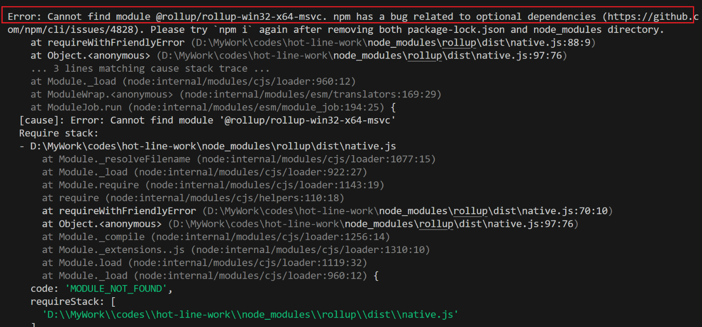

# Error:Cannot find module @rollup-win32-x64-msvc

## 报错表现

在搭建好基于 `vitepress` 的 `blog` 结构后，运行 `npm run docs:dev` 命令，进行部署前的运行结果检查，结果报以下错误：



**最为关键**的错误提示为以下一行代码：

```sh [powershell]
Error: Cannot find module '@rollup/rollup-win32-x64-msvc'
```

即当前依赖包中缺少`@rollup`相关，针对此错误有以下解决方法供参考。

## 解决方法

### 重新安装依赖

有可能是依赖安装的问题，**大部分问题都可以通过此方法解决**。具体步骤如下：

1. 删除 `node_modules` 和 `package-lock.json` 
2. 在项目根目录下打开终端，执行下述命令

::: code-group

```sh [pnpm]
pnpm install
```

```sh [npm]
npm install
```

:::

### 依赖版本问题

在项目根目录下打开终端，依次执行下述命令

::: code-group

```sh [pnpm]
pnpm add -D npm@latest
pnpm add -D vite
```

```sh [npm]
npm install -g npm@latest
npm install -g vite
```

:::

### 依赖缺失问题

执行下述代码

::: code-group

```sh [pnpm]
pnpm add -D @rollup/rollup-win32-x64-msvc
```

```sh [npm]
npm install @rollup/rollup-win32-x64-msvc
```

:::

## 运行验证

> [!TIP] 作者说
> 经历上述三个方法，你的问题基本能够得到解决，如果还有报错，请在下方评论，我将尽力为您解决。

执行命令运行项目，查看运行结果。（运行命令可能有所差异，根据你的 `package.json` 文件自行选择）

::: code-group

```sh [pnpm]
pnpm dev
```

```sh [npm]
npm run docs:dev
```

:::