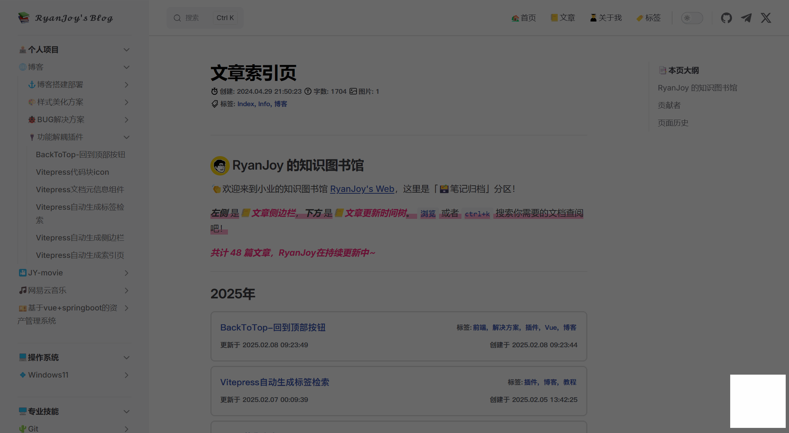
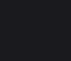

# BackToTop-回到顶部按钮

## 效果展示



按钮默认隐藏，只有当前位置不在「页面顶部」时才会出现；按钮外部有「环形进度条」，进度条与当前页面位置正相关；点击按钮返回页面顶部。

## 配置

### 组件定义

新建 `📄:.vitepress/theme/components/BackToTop/BackToTop.vue` 文件，复制粘贴下述内容：

```vue [BackToTop.vue]
<script setup lang="ts">
import { ref, onMounted, onUnmounted, computed } from 'vue'

const isVisible = ref(false)
const isHovered = ref(false)
const fillPercentage = ref(0)
const CIRCUMFERENCE = 2 * Math.PI * 20
const progressOffset = computed(() => 
    CIRCUMFERENCE * (1 - Math.floor(fillPercentage.value / 5) * 5 / 100)
)
let scrollTimeout: number | null = null
const handleScroll = () => {
    if (scrollTimeout) return
    scrollTimeout = window.setTimeout(() => {
        const scrollTop = window.scrollY
        const scrollHeight = document.documentElement.scrollHeight - document.documentElement.clientHeight
        fillPercentage.value = Math.min(Math.round((scrollTop / scrollHeight) * 100), 100)
        isVisible.value = scrollTop > 300
        scrollTimeout = null
    }, 16)
}
const scrollToTop = () => {
    const duration = 500
    const start = window.scrollY
    const startPercentage = fillPercentage.value
    const startTime = performance.now()
    const scroll = (currentTime: number) => {
        const elapsed = currentTime - startTime
        const progress = Math.min(elapsed / duration, 1)
        const easing = 1 - Math.pow(1 - progress, 3)
        window.scrollTo({
            top: start * (1 - easing),
            behavior: 'auto'
        })
        fillPercentage.value = Math.round(startPercentage * (1 - easing))
        if (progress < 1) {
            requestAnimationFrame(scroll)
        }
    }
    requestAnimationFrame(scroll)
}
onMounted(() => {
    window.addEventListener('scroll', handleScroll, { passive: true })
    handleScroll()
})
onUnmounted(() => {
    if (scrollTimeout) {
        window.clearTimeout(scrollTimeout)
    }
    window.removeEventListener('scroll', handleScroll)
})
</script>

<template>
    <button class="back-to-top" :class="{ visible: isVisible, hover: isHovered }" @click="scrollToTop"
        @mouseenter="isHovered = true" @mouseleave="isHovered = false" aria-label="返回顶部">
        <div class="progress-ring">
            <svg class="ring" viewBox="0 0 48 48">
                <circle class="ring-background" cx="24" cy="24" r="20" />
                <circle class="ring-progress" cx="24" cy="24" r="20"
                    :style="{ 'stroke-dashoffset': progressOffset }" />
            </svg>
            <svg class="icon" viewBox="0 0 1024 1024" version="1.1" xmlns="http://www.w3.org/2000/svg">
                <path d="M512 0A512 512 0 1 1 0 512 512 512 0 0 1 512 0z" fill="#FFDA00" />
                <path
                    d="M675.57181 542.524952a30.378667 30.378667 0 0 1-20.016762-7.533714l-145.627429-127.097905-140.970667 126.829715a30.47619 30.47619 0 0 1-40.764952-45.348572l161.060571-144.847238a30.47619 30.47619 0 0 1 40.423619-0.292571l165.961143 144.871619a30.47619 30.47619 0 0 1-20.065523 53.418666z"
                    fill="#111111" />
                <path
                    d="M512.073143 730.745905a30.47619 30.47619 0 0 1-30.476191-30.476191v-182.857143a30.47619 30.47619 0 0 1 60.952381 0v182.857143a30.47619 30.47619 0 0 1-30.47619 30.476191z"
                    fill="#111111" />
            </svg>
        </div>
    </button>
</template>

<style scoped>
.back-to-top {
    position: fixed;
    right: 2rem;
    bottom: 2rem;
    width: 3rem;
    height: 3rem;
    border: none;
    background: transparent;
    cursor: pointer;
    opacity: 0;
    transform: translateY(20px);
    transition: opacity 0.3s, transform 0.3s;
    z-index: 100;
    will-change: transform, opacity;
}

.back-to-top.visible {
    opacity: 1;
    transform: translateY(0);
}

.progress-ring {
    position: relative;
    width: 100%;
    height: 100%;
}

.ring {
    position: absolute;
    top: 0;
    left: 0;
    width: 100%;
    height: 100%;
    transform: rotate(-90deg);
    will-change: transform;
}

.ring-background {
    fill: none;
    stroke: var(--vp-c-bg-soft);
    stroke-width: 3;
}

.ring-progress {
    fill: none;
    stroke: var(--vp-c-brand-1);
    stroke-width: 3;
    stroke-linecap: round;
    stroke-dasharray: 125.66;
    transition: stroke-dashoffset 0.16s ease-out;
    will-change: stroke-dashoffset;
}

.icon {
    position: absolute;
    top: 50%;
    left: 50%;
    width: 70%;
    height: 70%;
    transform: translate(-50%, -50%);
    will-change: transform;
}

.back-to-top.hover {
    transform: scale(1.1);
}
</style>
```

### 组件注册和使用

在 `Vitepress` 主题配置文件 `📄:.vitepress/theme/index.ts` 中做以下修改：

```ts [index.ts]
import DefaultTheme from 'vitepress/theme'
import './style/index.css'
import BackToTop from './components/BackToTop/BackToTop.vue' // [!code ++]
// ...
export const Theme: ThemeConfig = {
  extends: DefaultTheme,
  Layout: () => {
    return h(DefaultTheme.Layout, null, {
      'layout-bottom': () => h(BackToTop) // [!code ++]
    })
  },
  // ...
  enhanceApp = ({ app }) => {
  	// ...
  	app.component('BackToTop', BackToTop) // [!code ++]
  }
  setup() {},
}

export default Theme
```

## 检验成果

滑动页面时，在右下角出现按钮，按钮样式跟随主题发生变化

|  |  |
| :--------------------------------------------------: | :--------------------------------------------------: |

::: details 为什么与我的样式不一致？

我在这篇文档编写的时候，又重新优化了我的样式，目前 `📄:.vitepress/theme/components/BackToTop/BackToTop.vue` 文件的内容我放在下方，如果有需要，您自行对比修改。

```vue [BackToTop.vue]
<script setup lang="ts">
import { ref, onMounted, onUnmounted, computed } from 'vue'

const isVisible = ref(false)
const isHovered = ref(false)
const fillPercentage = ref(0)

// 预计算圆环周长
const CIRCUMFERENCE = 2 * Math.PI * 20
const progressOffset = computed(() => 
    CIRCUMFERENCE * (1 - Math.floor(fillPercentage.value / 5) * 5 / 100)  // 将进度离散化，每5%更新一次
)

// 节流的滚动处理
let scrollTimeout: number | null = null
const handleScroll = () => {
    if (scrollTimeout) return

    scrollTimeout = window.setTimeout(() => {
        const scrollTop = window.scrollY
        const scrollHeight = document.documentElement.scrollHeight - document.documentElement.clientHeight
        
        fillPercentage.value = Math.min(Math.round((scrollTop / scrollHeight) * 100), 100)
        isVisible.value = scrollTop > 300
        
        scrollTimeout = null
    }, 8) // 约120fps
}

// 优化的滚动动画
const scrollToTop = () => {
    const duration = 500
    const start = window.scrollY
    const startPercentage = fillPercentage.value
    const startTime = performance.now()

    const scroll = (currentTime: number) => {
        const elapsed = currentTime - startTime
        const progress = Math.min(elapsed / duration, 1)
        
        const easing = 1 - Math.pow(1 - progress, 3)
        
        window.scrollTo({
            top: start * (1 - easing),
            behavior: 'auto'
        })

        // 直接从当前进度值递减
        fillPercentage.value = Math.round(startPercentage * (1 - easing))

        if (progress < 1) {
            requestAnimationFrame(scroll)
        }
    }

    requestAnimationFrame(scroll)
}

onMounted(() => {
    window.addEventListener('scroll', handleScroll, { passive: true })
    handleScroll()
})

onUnmounted(() => {
    if (scrollTimeout) {
        window.clearTimeout(scrollTimeout)
    }
    window.removeEventListener('scroll', handleScroll)
})
</script>

<template>
    <button class="back-to-top" :class="{ visible: isVisible, hover: isHovered }" @click="scrollToTop"
        @mouseenter="isHovered = true" @mouseleave="isHovered = false" aria-label="返回顶部">
        <div class="progress-ring">
            <svg class="ring" viewBox="0 0 48 48">
                <circle class="ring-background" cx="24" cy="24" r="20" />
                <circle class="ring-progress" cx="24" cy="24" r="20"
                    :style="{ 'stroke-dashoffset': progressOffset }" />
            </svg>
            <svg class="icon" viewBox="0 0 1024 1024" version="1.1" xmlns="http://www.w3.org/2000/svg">
                <path d="M512 0A512 512 0 1 1 0 512 512 512 0 0 1 512 0z" fill="var(--vp-c-brand-1)" />
                <path
                    d="M675.57181 542.524952a30.378667 30.378667 0 0 1-20.016762-7.533714l-145.627429-127.097905-140.970667 126.829715a30.47619 30.47619 0 0 1-40.764952-45.348572l161.060571-144.847238a30.47619 30.47619 0 0 1 40.423619-0.292571l165.961143 144.871619a30.47619 30.47619 0 0 1-20.065523 53.418666z"
                    fill="var(--main-page-bg)" />
                <path
                    d="M512.073143 730.745905a30.47619 30.47619 0 0 1-30.476191-30.476191v-182.857143a30.47619 30.47619 0 0 1 60.952381 0v182.857143a30.47619 30.47619 0 0 1-30.47619 30.476191z"
                    fill="var(--main-page-bg)" />
            </svg>
        </div>
    </button>
</template>

<style scoped>
/* 返回顶部按钮的基础样式 */
.back-to-top {
    position: fixed;  /* 固定定位 */
    right: 2rem;     /* 距离右侧边距 */
    bottom: 2rem;    /* 距离底部边距 */
    width: 3rem;     /* 按钮宽度 */
    height: 3rem;    /* 按钮高度 */
    border: none;    /* 移除边框 */
    background: transparent;  /* 透明背景 */
    cursor: pointer; /* 鼠标指针样式 */
    opacity: 0;      /* 初始透明 */
    transform: translateY(20px);  /* 初始向下偏移 */
    transition: opacity 0.3s, transform 0.3s;  /* 过渡动画 */
    z-index: 100;    /* 确保按钮在其他元素上方 */
    will-change: transform, opacity;  /* 提示浏览器优化这些属性的变化 */
}

/* 按钮可见时的样式 */
.back-to-top.visible {
    opacity: 1;      /* 完全不透明 */
    transform: translateY(0);  /* 恢复正常位置 */
}

/* 进度环容器 */
.progress-ring {
    position: relative;  /* 相对定位，作为子元素的定位参考 */
    width: 100%;        /* 填充父元素宽度 */
    height: 100%;       /* 填充父元素高度 */
}

/* 环形SVG容器 */
.ring {
    position: absolute;  /* 绝对定位 */
    top: 0;
    left: 0;
    width: 100%;
    height: 100%;
    transform: rotate(-90deg);  /* 旋转使进度从顶部开始 */
    will-change: transform;     /* 优化变换性能 */
}

/* 环形背景 */
.ring-background {
    fill: none;                    /* 无填充 */
    stroke: var(--vp-c-bg-soft);   /* 使用主题软背景色 */
    stroke-width: 3;               /* 线条宽度 */
}

/* 进度条环形 */
.ring-progress {
    fill: none;                    /* 无填充 */
    stroke: var(--vp-c-brand-3);   /* 使用主题主色 */
    stroke-width: 3;               /* 线条宽度 */
    stroke-linecap: round;         /* 圆形线帽 */
    stroke-dasharray: 125.66;      /* 虚线周长 */
    transition: stroke-dashoffset 0.16s ease-out;  /* 平滑过渡 */
    will-change: stroke-dashoffset;  /* 优化描边偏移动画 */
}


/* 中心图标 */
.icon {
    position: absolute;            /* 绝对定位 */
    top: 50%;
    left: 50%;
    width: 70%;                   /* 图标大小 */
    height: 70%;
    transform: translate(-50%, -50%);  /* 居中对齐 */
    will-change: transform;            /* 优化变换性能 */
}

/* 悬浮效果 */
.back-to-top.hover {
    transform: scale(1.1);  /* 悬浮时放大效果 */
}
</style>
```

:::