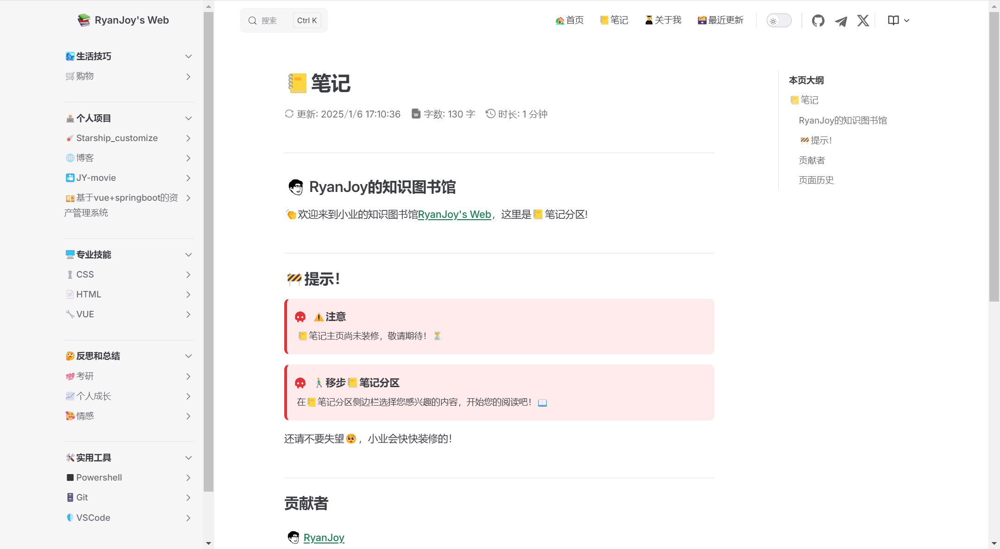

# Vitepress自动生成侧边栏

::: tip 插件相关

- Github仓库：[@ryanjoy/vitepress-plugin-sidebar](https://github.com/get1024/customIntegrations/tree/main/vitepress-plugin-sidebar)
- npm地址：[@ryanjoy/vitepress-plugin-sidebar](https://www.npmjs.com/package/@ryanjoy/vitepress-plugin-sidebar)
:::

## 安装

通过运行以下命令将 `@ryanjoy/vitepress-plugin-sidebar` 安装到您的项目依赖项中：

::: code-group

```shell [pnpm]
pnpm add @ryanjoy/vitepress-plugin-sidebar -D
```

```shell [npm]
npm i @ryanjoy/vitepress-plugin-sidebar -D
```

```shell [yarn]
yarn add @ryanjoy/vitepress-plugin-sidebar -D
```

:::

## 使用

### 为 VitePress 配置

在 VitePress 的配置文件中（通常为 `docs/.vitepress/config.ts`，文件路径和拓展名也许会有区别），将 `@ryanjoy/vitepress-plugin-sidebar` 作为一个插件导入：

```typescript [config.mts]
import { defineConfigWithTheme } from 'vitepress'
import { calculateSidebar } from '@ryanjoy/vitepress-plugin-sidebar' // [!code ++]

export default defineConfigWithTheme({
  lang: 'zh-CN',
  title: '网站名称', // 仅供参考，请不要直接复制
  description: '某些介绍', // 仅供参考，请不要直接复制
  themeConfig: {
    // 其他各种配置...
    sidebar: calculateSidebar([ // [!code ++]
      '文件夹A', // [!code ++]
      { folderName: '文件夹B', separate: true }, // [!code ++]
    ]), // [!code ++]
  },
})
```

## 参数说明

### `calculateSidebar`

`calculateSidebar` 函数接受一个**数组**作为参数，数组中的每一项可以是一个字符串或者一个对象。不同的类型会有着不同的处理逻辑。让我们以下面的几种实际应用场景来说明。

首先需要指出的是，在配置参数中填写 `'文件夹名'` 和 `{ folderName: '文件夹名', separate: false }` 是完全等效的，所以，只书写字符串的配置，可以看作是 `{ folderName: '文件夹名', separate: false }` 的快捷简写。因此，如果希望配置参数格式上统一，可以都写成对象的形式。

另外，在几乎 100% 的情况下，我们都会按照与 Obsidian 和 [RyanJoy's Web](https://blog.ryanjoy.top/) 的侧边栏结构和形式去生成侧边栏，所以在绝大多数情况下，只写字符串也不会有问题。

唯一的区别就是在于这个特殊的 `separate` 属性。当用户配置了 `separate: true` 之后，我们会生成 VitePress 所兼容和支持的多侧边栏，这使得「根据页面路径显示不同的侧边栏」变成可能。

说得更直白一些，如果你希望能够在 `/A` 路径下展示仅与 A 目录相关的侧边栏，`/B` 路径只展示 B 目录的侧边栏，那么你就需要 `[{ folderName: 'A', separate: true }, { folderName: 'B', separate: true }]` 这样的配置。<span class="marker-underline">推荐使用此配置。</span>

### 特殊的处理规则

#### 规则一-专一配置

<p style="color:red;font-weight:bold">1-separate: false</p>

如果参数中**只**填写了 `[文件夹名,文件夹名]` 这样的**字符串参数**或`{ folderName: '文件夹名', separate: false }`这样的**对象参数**时，构建侧边栏时会自动把不同 `/文件夹名` 路径忽略掉，全局**不会**根据不同的页面路径显示不同侧边栏。我们称之为：**差异路径忽略**。以本博客为例

如此配置

```ts [config.ts]
// 方式一
sidebar: calculateSidebar([
    { folderName: "👨🏼‍🎓关于我", separate: false },
    { folderName: "📒文章", separate: false },
]),
// 方式二
sidebar: calculateSidebar([
    "👨🏼‍🎓关于我",
    "📒文章",
]),
```

效果如下


注意到：侧边栏显示结果为**当前所配置的文件夹名**。

<p style="color:red;font-weight:bold">2-separate: true</p>

如果参数中**只**填写了 `{ folderName: '文件夹名', separate: true }` 这样的**对象参数**时，会根据不同的页面路径显示不同侧边栏。以本博客为例

如此配置

```ts [config.ts]
sidebar: calculateSidebar([
    { folderName: "👨🏼‍🎓关于我", separate: true },
    { folderName: "📒文章", separate: true },
]),
```

效果如下

|                         /📒文章                          |                      /👨🏼‍🎓关于我                       |
| :----------------------------------------------------: | :----------------------------------------------------: |
|  |  |

注意到：侧边栏显示结果为**当前所配置的文件夹名路径下的内容**。

#### 规则二-混合配置

如果**既有**`字符串配置`**又有** `{ folderName: 'A', separate: true }` 的配置，那么，[差异路径忽略](#规则一-专一配置) 的规则将不再生效。以本博客为例

如此配置

```typescript [config.ts]
calculateSidebar([
    "👨🏼‍🎓关于我",
    { folderName: "📒文章", separate: true },
])
```

效果如下

|                      /📒文章                      |                   /👨🏼‍🎓关于我                   |
| :---------------------------------------------: | :---------------------------------------------: |
|  |  |

注意到：侧边栏显示结果有如下区别————对于 `separate: true` 配置的侧边栏，显示为**当前所配置的文件夹名路径下的内容**；对于 `separate: false` （等价于 `字符串参数` ）配置的侧边栏，显示为**当前所配置的文件夹名**。这也不难理解，因为刚好与 [规则一：专一配置](#规则一-专一配置) 所呈现的效果严格对应。

## 可选性配置

上述配置完成了自动生成侧边栏，但不难发现，上述配置，实现效果在最理想情况下也只能做到展示对应路径下第一层级的内容（即 `/path/` 下的内容）。而考虑到你可能想要原生配置的 [`collapse:false`选项](https://vitepress.dev/zh/reference/default-theme-sidebar#collapsible-sidebar-groups) 实现的**指定路径下首级文件夹自动展开**效果，可以在完成上述配置的前提下进行下列配置。

### 为 VitePress 配置

在 VitePress 的配置文件中（通常为 `docs/.vitepress/config.ts`，文件路径和拓展名也许会有区别）。

如此配置

```ts [config.ts] twoslash:no-line-numbers
import { defineConfig } from "vitepress";
import { calculateSidebar } from '@ryanjoy/vitepress-plugin-sidebar'; // [!code --]
import { calculateSidebar as originalCalculateSidebar } from "@ryanjoy/vitepress-plugin-sidebar"; // [!code ++] 
//...
function calculateSidebarWithDefaultOpen(targets:any, base:any) { // [!code ++] 
  const result = originalCalculateSidebar(targets, base); // [!code ++] 
  if (Array.isArray(result)) { // [!code ++] 
    result.forEach((item: any) => { // [!code ++] 
      item.collapsed = false;  // [!code ++] 
    }); // [!code ++] 
  } else { // [!code ++] 
    Object.values(result).forEach((items: any[]) => { // [!code ++] 
      items.forEach((item: any) => { // [!code ++] 
        item.collapsed = false;  // [!code ++] 
      }); // [!code ++] 
    }); // [!code ++] 
  } // [!code ++] 
  return result; // [!code ++] 
} // [!code ++] 
//...
export default defineConfig({
  //...
})
```

### 修改sidebar配置

如此配置

```ts [config.ts]
export default defineConfig({
  //...
  themeConfig: {
    //...
    sidebar: calculateSidebarWithDefaultOpen([ // [!code focus]
      { folderName: "folderName", separate: true },
      { folderName: "folderName", separate: true },
      //...
    ],''), //base参数根据自身具体配置 // [!code focus]
    //...
  }
}
```

::: details `base`是什么？

找到先前在`config.ts`文件中的引入`import { calculateSidebar as originalCalculateSidebar } from "@ryanjoy/vitepress-plugin-sidebar";`，鼠标置于`calculateSidebar`上，左键单击进入`index.d.ts`文件，如下

```ts{11-14} [index.d.ts]
interface ArticleTree {
    index: string;
    text: string;
    link?: string;
    lastUpdated?: number;
    collapsible?: true;
    collapsed?: boolean;
    items?: ArticleTree[];
    category?: string;
}
declare function calculateSidebar(targets?: Array<string | {
    folderName: string;
    separate: boolean;
}>, base?: string): ArticleTree[] | Record<string, ArticleTree[]>;

export { calculateSidebar };
```

观察到`calculateSidebar()`有两个参数`(target, base)`，`targe`是在配置文件中传入的 字符串参数 或 对象参数 ，`base`是你的vitepress项目配置的基路径，通常情况下为`' '`即可。

:::

### 检验效果

|                         /📒文章                          |                       /👨🏼‍🎓关于我                       |
| :----------------------------------------------------: | :-----------------------------------------------------: |
|  |  |

注意到：侧边栏显示结果为**当前所配置的文件夹名路径下的内容**，并且路径下首级文件夹已经展开。

:::details 想要展开所有层级的文件夹至最末端文件？

可以尝试把 VitePress 的配置文件定义的函数修改如下

```ts [config.ts]
function calculateSidebarWithDefaultOpen(targets, base) {
  const result = originalCalculateSidebar(targets, base);
  function setAllCollapsedFalse(items) {
    items.forEach(item => {
      item.collapsible = true; 
      item.collapsed = false;
      if (item.items) {
        setAllCollapsedFalse(item.items);
      }
    });
  }
  if (Array.isArray(result)) {
    setAllCollapsedFalse(result);
  } else {
    Object.values(result).forEach(items => {
      setAllCollapsedFalse(items);
    });
  }
  return result;
}
```

:::