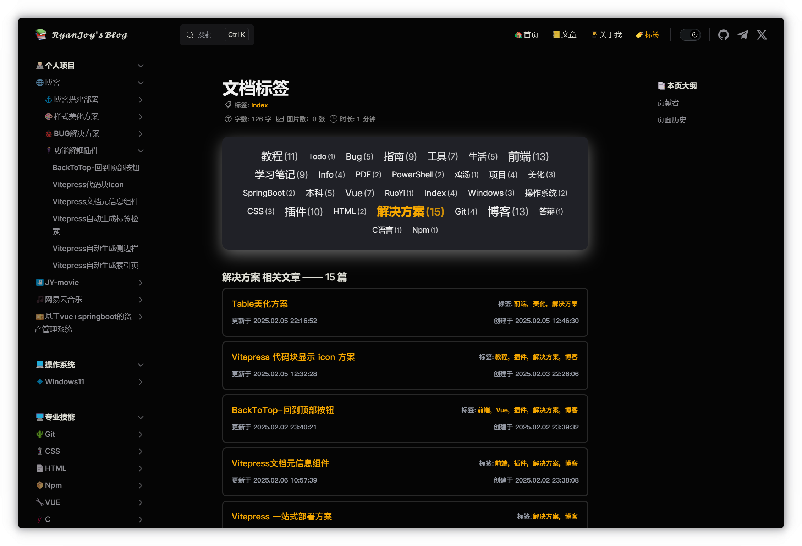

# Vitepress自动生成标签检索

## 效果展示



上方显示 `tagCloud` ，点击 `tag` 下方列出对应文章列表。

## 前提条件

本解决方案是依赖于 `markdown` 文档的 `frontmatter` 配置，因此，要求每一个 `markdown` 文档都要有下述开头：

```md [example.md]
---
title:
creatAt: YYYY-MM-DD HH:mm:ss
updateAt: YYYY-MM-DD HH:mm:ss
tags:
  - 标签1
  - 标签2
  - ...
---
```

## 组件定义

### 标签数据脚本文件

新建 `📄:.vitepress/theme/components/TagCloud/tags.data.ts` 文件，复制粘贴下述内容

```ts [tags.data.ts]
// .vitepress/theme/components/TagCloud/tags.data.ts
import { ContentData, createContentLoader } from 'vitepress'
function splitDate(dateStr: string) {
    const date = new Date(dateStr)
    return {
        year: date.getUTCFullYear(),
        month: (date.getUTCMonth() + 1).toString().padStart(2, '0'),
        day: date.getUTCDate().toString().padStart(2, '0'),
        hour: date.getUTCHours().toString().padStart(2, '0'),
        minute: date.getUTCMinutes().toString().padStart(2, '0'),
        second: date.getUTCSeconds().toString().padStart(2, '0')
    }
}
interface Post {
    url: string
    frontmatter: {
        title: string
        tags?: string[]
        createAt: {
            year: number
            month: string
            day: string
            hour: string
            minute: string
            second: string
        }
        updateAt: {
            year: number
            month: string
            day: string
            hour: string
            minute: string
            second: string
        }
    }
}
interface Tag {
    name: string
    count: number
    posts: Post[]
    size: number
}
const calculateSize = (count: number, maxCount: number): number => {
    const minSize = 0.9
    const maxSize = 1.4
    const scale = (count - 1) / (maxCount - 1)
    return minSize + (maxSize - minSize) * scale
}
declare const data: Tag[]
export { data }
export default createContentLoader('**/*.md', { // [!code warning]
//                                  ^?
    transform(raw: ContentData[]) {
        const tagMap = new Map<string, { count: number; posts: ContentData[] }>()
        raw.forEach(post => {
            const tags = post.frontmatter.tags || []
            tags.forEach(tag => {
                if (!tagMap.has(tag)) {
                    tagMap.set(tag, { count: 0, posts: [] })
                }
                const tagData = tagMap.get(tag)!
                tagData.count++
                tagData.posts.push(post)
            })
        })
        const maxCount = Math.max(...Array.from(tagMap.values()).map(t => t.count))
        const tags: Tag[] = Array.from(tagMap.entries())
            .map(([name, data]) => ({
                name,
                count: data.count,
                posts: data.posts
                    .map(post => ({
                        url: post.url,
                        frontmatter: {
                            title: post.frontmatter.title,
                            tags: post.frontmatter.tags,
                            createAt: splitDate(post.frontmatter.createAt),
                            updateAt: splitDate(post.frontmatter.updateAt)
                        }
                    }))
                    .sort((a, b) => {
                        const dateA = new Date(
                            `${a.frontmatter.createAt.year}-${a.frontmatter.createAt.month}-${a.frontmatter.createAt.day}`
                        )
                        const dateB = new Date(
                            `${b.frontmatter.createAt.year}-${b.frontmatter.createAt.month}-${b.frontmatter.createAt.day}`
                        )
                        return dateB.getTime() - dateA.getTime()
                    }) as Post[],
                size: calculateSize(data.count, maxCount)
            }))
            .sort(() => Math.random() - 0.5)
        return tags
    }
}) 
```

注意到，我这里高亮了一行代码，主要关注<span class="marker-evy">`'**/*.md'`</span>。这一参数表示<span class="marker-underline">项目根目录下所有 `.md` 文件</span>。如果你只需要检索某一指定文件夹如 `📂:'/笔记'` 下的所有 `.md` 文件，那么你需要修改参数为 `'笔记/**/*.md'`

### 文章列表组件

::: tip 作者说

这里我把「文章列表组件」和「标签云组件」进行解耦，主要目的是为了**复用**「文章列表组件」。

:::

新建 `📄:.vitepress/theme/components/PostList/PostList.vue` ，复制粘贴下述内容：

```vue [PostList.vue]
<script setup lang="ts">
import { computed } from 'vue'
import { data as tagsData } from '../TagCloud/tags.data'
interface Post {
    url: string
    frontmatter: {
        title: string
        tags?: string[]
        createAt: {
            year: number
            month: string
            day: string
            hour: string
            minute: string
            second: string
        }
        updateAt: {
            year: number
            month: string
            day: string
            hour: string
            minute: string
            second: string
        }
    }
}
const props = defineProps<{
    posts: Post[]
}>()
const processedPosts = computed(() => {
    return props.posts.map(post => {
        const postTags = tagsData.reduce((acc: string[], tagItem) => {
            if (tagItem.posts.some(p => p.url === post.url)) {
                acc.push(tagItem.name)
            }
            return acc
        }, [])
        return {
            ...post,
            frontmatter: {
                ...post.frontmatter,
                tags: postTags
            }
        }
    })
})
</script>

<template>
    <ul class="post-list-ul">
        <a class="post-link" v-for="post of processedPosts" :key="post.url" :href="post.url">
            <li class="post-item">
                <div class="post-content">
                    <div class="post-title-container">
                        <span class="post-title">{{ post.frontmatter.title }}</span>
                        <span class="post-tags" v-if="post.frontmatter.tags?.length">
                            <span class="tag-label">标签:</span>
                            <span
                                v-for="(tag, index) in post.frontmatter.tags"
                                :key="tag"
                                class="tag-item"
                            >
                                {{ tag }}{{ index < post.frontmatter.tags.length - 1 ? ', ' : '' }}
                            </span>
                        </span>
                    </div>
                    <div class="post-dates">
                        <span class="post-update">
                            更新于 {{ post.frontmatter.updateAt.year }}.{{ post.frontmatter.updateAt.month }}.{{
                                post.frontmatter.updateAt.day }} {{ post.frontmatter.updateAt.hour }}:{{
                                post.frontmatter.updateAt.minute }}:{{ post.frontmatter.updateAt.second }}
                        </span>
                        <span class="post-date">
                            创建于 {{ post.frontmatter.createAt.year }}.{{ post.frontmatter.createAt.month }}.{{
                                post.frontmatter.createAt.day }} {{ post.frontmatter.createAt.hour }}:{{
                                post.frontmatter.createAt.minute }}:{{ post.frontmatter.createAt.second }}
                        </span>
                    </div>
                </div>
            </li>
        </a>
    </ul>
</template>

<style scoped>
.post-list-ul {
    list-style: none;
    padding: 0;
    margin: 0;
}   
.post-link {
    text-decoration: none;
    display: block;
}
.post-link:hover .post-title {
    text-decoration: underline;
}
.post-item {
    margin: 8px 0;
    padding: 1rem;
    transition: transform 0.16s ease, box-shadow 0s ease;
    border: 2px solid var(--custom-border); /* [!code warning] */
    border-radius: 0.5rem;
    background-color: transparent;
}
.post-item:hover {
    transform: translateY(-5px);
    box-shadow: var(--custom-shadow); /* [!code warning] */
}
.post-content {
    display: flex;
    flex-direction: column;
    gap: 0.5rem;
}
.post-title-container {
    flex: 1;
    display: flex;
    justify-content: space-between;
    align-items: center;
    flex-wrap: wrap;
    gap: 1rem;
}
.post-title {
    font-family: monospace;
    text-decoration: none;
    word-break: break-word;
    flex-shrink: 0;
}
.post-tags {
    color: gray;
    font-family: monospace;
    font-size: 0.76em;
    font-weight: bolder;
}
.tag-label {
    color: var(--custom-text); /* [!code warning] */
}
.tag-item {
    color: var(--vp-c-brand-1);
    margin: 0 2px;
}
.post-dates {
    display: flex;
    justify-content: space-between;
    gap: 1rem;
    flex-wrap: wrap;
}
.post-update,
.post-date {
    color: var(--custom-text); /* [!code warning] */
    font-family: monospace;
    font-size: 0.76em;
    font-weight: bolder;
}
@media (max-width: 768px) {
    .post-content {
        gap: 0.8rem;
    }
    .post-title-container {
        flex-direction: column;
        align-items: flex-start;
        gap: 0.4rem;
    }
    .post-dates {
        flex-direction: column;
        gap: 0.3rem;
    }
    .post-update,
    .post-date {
        white-space: normal;
        min-width: unset;
    }
    .post-item {
        padding: 0.8rem;
    }
}
</style>
```

注意到，在 `<style scoped></style>` 标签中，存在几行高亮代码，这同样是为了满足复用需求而自定义的样式，具体配置在别的文档中提到过，这里不再赘述，详细配置见这里：[个性化配置](../🎨样式美化方案/代码块、组美化方案.md#个性化配置)

### 标签云组件

新建 `📄:.vitepress/theme/components/TagCloud/TagCloud.vue` ，复制粘贴下述内容：

```vue [TagCloud.vue]
// .vitepress/theme/components/TagCloud/TagCloud.vue
<script setup lang="ts">
import { ref, computed, onMounted } from 'vue'
import { data as tags } from './tags.data'
import PostList from '../PostList/PostList.vue'
const selectedTag = ref('')
const selectedPosts = computed(() => {
    if (!selectedTag.value) return []
    return tags.find(t => t.name === selectedTag.value)?.posts || []
})
const selectTag = (tag: string) => {
    selectedTag.value = selectedTag.value === tag ? '' : tag
}
onMounted(() => {
    const urlParams = new URLSearchParams(window.location.search)
    const tagParam = urlParams.get('tag')
    if (tagParam) {
        selectedTag.value = decodeURIComponent(tagParam)
    }
})
</script>

<template>
  <div class="tag-section">
    <div class="tag-cloud">
      <div class="tags-container">
        <span
          v-for="tag in tags"
          :key="tag.name"
          class="tag-item"
          :class="{ active: selectedTag === tag.name }"
          :style="{ fontSize: `${tag.size}rem` }"
          @click="selectTag(tag.name)"
        >
          <span class="tag-text">{{ tag.name }}</span>
          <span class="tag-count">({{ tag.count }})</span>
        </span>
      </div>
    </div>
    <div v-if="selectedTag && selectedPosts.length" class="posts-list">
      <h4>{{ selectedTag }} 相关文章 —— {{ selectedPosts.length }} 篇</h4>
      <PostList :posts="selectedPosts" />
    </div>
  </div>
</template>

<style scoped>
.tag-section {
    display: flex;
    flex-direction: column;
}
.tag-cloud {
    background-color: var(--vp-c-bg-soft);
    border-radius: 12px;
    padding: 20px;
    margin: 1rem 0;
    box-shadow: var(--custom-shadow); /* [!code warning] */
}
.tags-container {
    display: flex;
    flex-wrap: wrap;
    justify-content: center;
    align-items: center;
}
.tag-item {
    display: inline-block;
    padding: 0.3rem 0.6rem;
    border-radius: 1rem;
    cursor: pointer;
    transition: all 0.16s ease;
    color: var(--main-page-text); /* [!code warning] */
    background: transparent;
}
.tag-item:hover {
    color: var(--vp-c-brand-1);
    transform: translateY(-2px);
    background-color: var(--main-page-bg); /* [!code warning] */
}
.tag-item.active {
    color: var(--vp-c-brand-1);
    font-weight: bold;
}
.tag-count {
    margin-left: 2px;
    opacity: 0.8;
    font-size: 0.9em;
}
</style> 
```

这里高亮代码同前文。

## 组件注册

在 `Vitepress` 主题配置文件 `📄:.vitepress/theme/index.ts` 中添加：

```ts [index.ts]
import DefaultTheme from 'vitepress/theme'
import TagCloud from './components/TagCloud/TagCloud.vue' // [!code ++]
// ...
export const Theme: ThemeConfig = {
  extends: DefaultTheme,
  // ...
  enhanceApp = ({ app, router }: EnhanceAppContext) => {
  	// ...
  	app.component('TagCloud', TagCloud) // [!code ++]
  }
  // ...
}
```

## 组件使用

在需要出现 `标签索引` 的文档输入 `<TagCloud />` 。