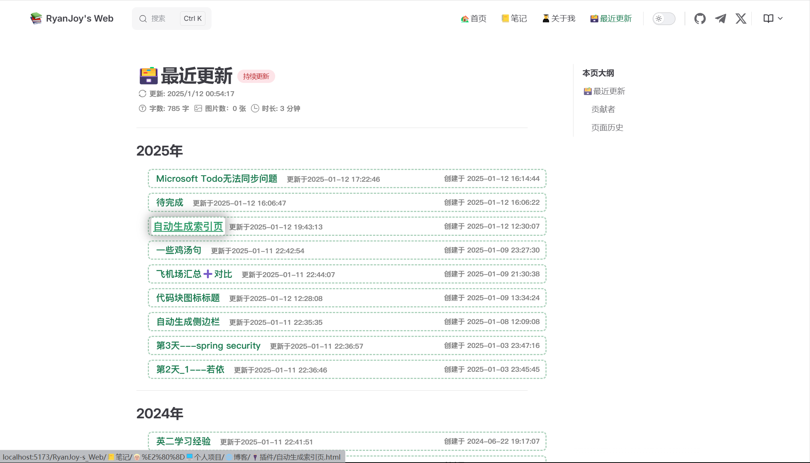

# Vitepress自动生成索引页

::: tip 作者说

本文档旨在说明如何根据 文档创建时间 **自动生成索引页**。此实现并非是通过npm依赖包导入，而是自定义vue组件，并使用官方文档提供的 [`createContentLoader`](https://vitepress.dev/zh/guide/data-loading#createcontentloader)  字段来帮助我们简化实现。

本文档提供无脑式配置教程，如果需要理解实现原理，请参考 [官方文档](https://vitepress.dev/zh/guide/data-loading) 。

:::

## 前置介绍

### 项目结构明晰

要想能够成功的在您的 vitepress 博客中进行此实现，我必须为您进行一些前置介绍。

我的文档结构如下。

```shell [powershell]
RyanJoy-s_Web
|-- 👨🏼‍🎓关于我
|   |-- 联系我.md
|   |-- index.md
|-- 📒文章
|   |-- 🏙️生活技巧/...
|   |-- 👨🏼‍💻个人项目/...
|   |-- 💻操作系统/...
|   |-- 🖥️专业技能/...
|   |-- 🤔反思和总结/...
|   |-- 🛠️实用工具/...
|   |-- index.md
|-- node_modules/...
|-- public/...
|-- index.md
|-- ResentUpdate.md
```

易见我的项目结构没有 `'/docs/'` 存在，不过不必慌张，这一因素造成的区别也只会体现在 Vitepress 配置文件 `config.ts` 中的 [`base:`](https://vitepress.dev/zh/reference/site-config#base) 选项。我相信你在最初构建项目时，就已经完成了对它的配置。

我需要展示在 [索引列表](/📒文章/index.md) 的笔记只是 `'/📒文章/'` 目录下的。至于 `'/👨🏼‍🎓关于我/'` 和 `'/index.md'` 、 `'/ResentUpdate.md'` 都是通过 `config.mts` 文件中的 [`nav` 配置](https://vitepress.dev/zh/reference/default-theme-config#nav) 指向的。这么安排主要是因为，我要搭建的是一个「博客」而不是其它的什么东西，因此除了 `'/📒文章/'` 目录下的内容都不应该出现在索引页中。

### 文档结构明晰

由于本实现是根据文档创建时间进行分组、排序……等需求，这就要求每篇 `markdown` 文档前必须有 属性 配置。

有几个必要选项如下

```md [example.md]
---
title:  文章标题
createAt:  YYYY-MM-DD HH:mm:ss
updateAt:  YYYY-MM-DD HH:mm:ss
---
```

`title` 是文档的标题；

`createAt` 是文章创建的时间， `updateAt` 是文章最近一次编辑的时间。二者的格式均为 `YYYY-MM-DD HH:mm:ss` 。

对于每篇文档中的这三个字段，您可以手动输入配置，或通过一些插件进行实现。由于笔者是基于 [Obsidian](https://obsidian.md/) 进行文档编写，我采用了 [插件](../⚓博客搭建部署/个人博客搭建、使用最佳解决方案.md#文件配置) 实现文档格式化，自动添加以上三个属性。如果读者有更好的实现方案，请访问 [本仓库](https://github.com/get1024/RyanJoy-s_Web) `fork` 并提出 `PR` 。

对于上述配置如果您还有自己的需求，当然可以进行更多的键值对 `[属性名]: [属性值]` 配置。

## 开始配置

### 配置 TypeScript

在 `'/.vitepress/theme/utils/'` 下新建 `note.data.ts` 文件。

```ts [node.data.ts]
//.vitepress/theme/utils/note.data.ts
import { createContentLoader } from "vitepress";

// 规格化日期和时间，供vue组件调用
// 请勿修改！请勿修改！请勿修改！请勿修改！请勿修改！请勿修改！请勿修改！请勿修改！
function splitDate(dateStr: string) {
    const date = new Date(dateStr);
    return {
        year: date.getUTCFullYear(),
        month: (date.getUTCMonth() + 1).toString().padStart(2, '0'),
        day: date.getUTCDate().toString().padStart(2, '0'),
        hour: date.getUTCHours().toString().padStart(2, '0'),
        minute: date.getUTCMinutes().toString().padStart(2, '0'),
        second: date.getUTCSeconds().toString().padStart(2, '0')
    };
}

// 把所有文章条目按 年 分组
// 请勿修改！请勿修改！请勿修改！请勿修改！请勿修改！请勿修改！请勿修改！请勿修改！
function groupByYear(posts) {
    return posts.reduce((acc, post) => {
        const year = post.frontmatter.createAt.year;
        if (!acc[year]) {
            acc[year] = [];
        }
        acc[year].push(post);
        return acc;
    }, {});
}

// 需要修改！需要修改！需要修改！需要修改！需要修改！需要修改！需要修改！需要修改！
export default createContentLoader("📒文章/**/*.md", { // [!code error]
    transform(rawPosts) {
        const postsWithDate = rawPosts.map((post) => {
            const { createAt, updateAt } = post.frontmatter;
            post.frontmatter.createAt = splitDate(createAt);
            post.frontmatter.updateAt = splitDate(updateAt);
            return post;
        });
        return groupByYear(postsWithDate);
    },
});
```

特别需要注意的是 `"📒文章/**/*.md"` 参数，对于你的文档配置，若你想要输出 `'/A'` 文件夹下的 `markdown` 文档到 索引页 ，将参数修改为 `"A/**/*.md"` 。

<span class="marker-underline">配置正确情况下，只需对 32 行进行修改</span>。

### 配置样式文件

在 `.vitepress/theme/style/` 下新建 `nodeIndex.css` 文件。

```css [nodeIndex.css]
ul.noteIndex-ul {
    padding: 0 0 0 20px; /* 确保小圆点正常显示 */
    list-style-type: disc;
}

.post-item {
    display: flex;
    justify-content: space-between;
    align-items: center;
    width: 105%;
    margin: 8px 0;
    padding-left: 10px;
    padding-right: 10px;
    transition: transform 0.3s ease, box-shadow 0.3s ease;
    border-style: dashed;
    border-radius: 7px;
    border-color: rgba(15, 124, 60, 0.349);
}

.post-link-update {
    text-align: left;
}

.post-link-update a{
    font-family: monospace;
    text-decoration:none;
    display: inline-block; /* 确保 padding 应用到 a 标签 */
    padding: 3px; /* 添加默认的内边距，避免悬浮时跳动 */
    border-radius: 5px; /* 统一圆角，避免悬浮时变化 */
    transition: transform 0.3s ease, box-shadow 0.3s ease, padding 0.3s ease, background-color 0.3s ease;
}

.post-link-update a:hover {
    transform: scale(1.1);
    box-shadow: 0 0 15px 5px rgba(0, 0, 0, 0.281);
    background-color: transparent;
    text-decoration: underline;
}

.post-update{
    color: gray;
    font-family: monospace; 
    white-space: nowrap;
    min-width: 200px;
    font-size: 0.76em;
    font-weight: bolder;
}

.post-date {
    text-align: right;
    color: gray;
    font-family: monospace; 
    white-space: nowrap;
    min-width: 200px;
    font-size: 0.76em;
    font-weight: bolder;
}

h2.noteIndex-h2 {
    font-weight: bold;
    font-size: 1.5em;
    margin-top: 20px;
}
```

<span class="marker-underline">可以根据自己喜好进行修改。</span>

### 配置 Vue 组件

在 `.vitepress/theme/components/` 下新建 `noteIndex.vue` 文件。

```vue [nodeIndex.vue]
//.vitepress/theme/components/noteIndex.vue
<script setup>
import { data as posts } from '../utils/note.data.ts'
import '../style/nodeIndex.css'
import { useData } from "vitepress"

const groupedPosts = Object.entries(posts)
  .map(([year, yearPosts]) => ({
    year,
    posts: yearPosts.sort((a, b) => {
      const aDate = a.frontmatter.createAt;
      const bDate = b.frontmatter.createAt;
      if (bDate.month !== aDate.month) {
        return bDate.month - aDate.month;
      }
      if (bDate.day !== aDate.day) {
        return bDate.day - aDate.day;
      }
      if (bDate.hour !== aDate.hour) {
        return bDate.hour - aDate.hour;
      }
      if (bDate.minute !== aDate.minute) {
        return bDate.minute - aDate.minute;
      }
      if (bDate.second !== aDate.second) {
        return bDate.second - aDate.second;
      }
      return 0;
    }),
  }))
  .sort((a, b) => b.year - a.year);
</script>

<template>
  <div v-for="group in groupedPosts" :key="group.year">
    <h2 class="noteIndex-h2">{{ group.year }}年</h2>
    <ul class="noteIndex-ul">
      <li v-for="post of group.posts" :key="post.url" class="post-item">
        <span class="post-link-update">
          <a :href="'/RyanJoy-s_Web'+post.url">{{ post.frontmatter.title }}</a> // [!code warning]
          &nbsp;
          <span class="post-update">更新于{{ post.frontmatter.updateAt.year }}-{{ post.frontmatter.updateAt.month }}-{{ post.frontmatter.updateAt.day }} {{ post.frontmatter.updateAt.hour }}:{{ post.frontmatter.updateAt.minute }}:{{ post.frontmatter.updateAt.second }}</span>
        </span>
        <span class="post-date">创建于 {{ post.frontmatter.createAt.year }}-{{ post.frontmatter.createAt.month }}-{{ post.frontmatter.createAt.day }} {{ post.frontmatter.createAt.hour }}:{{ post.frontmatter.createAt.minute }}:{{ post.frontmatter.createAt.second }}</span>
      </li>
    </ul>
  </div>
</template>
```

特别要注意 `:href="'/RyanJoy-s_Web'+post.url"` 参数。如果你的博客首页网址是 `https://xxx.xxx.io/` ，则只需要设置为 `:href="post.url"` ；如果你的博客首页网址是 `https://xxx.xxx.io/[example]/` ，则只需要设置为 `:href="'/[example]'+post.url"` 。

其实本质也就是 `base` 的问题，这一点我们在 [项目结构明晰](#项目结构明晰) 也提到过，如果您实在不确定该如何配置，建议您逐层实验 或者 询问 ChatGPT。

<span class="marker-underline">配置正确情况下，此文件只需对 40 行进行修改</span>。

### 注册组件

在 Vitepress 样式配置文件 `.vitepress/theme/index.ts` 中进行配置。

```ts [index.ts]
//.vitepress/theme/index.ts
import nodeIndex from "./components/noteIndex.vue" // 导入组件定义文件 // [!code ++]
//...
export const Theme: ThemeConfig = {
	  extends: DefaultTheme,
	  //...
	  enhanceApp({ app, router}) {
		//...
		app.component('nodeIndex',nodeIndex) //注册组件 // [!code ++]
		//...
	  }
}
```

### 创建索引页并使用组件

我选择在项目根目录下创建 `ResentUpdate.md` 文件，可以再次查看 [项目结构明晰](#项目结构明晰)。

```md [ResentUpdate.md]
---
title: 🗃️最近更新
sidebar: false
createAt: 2024-04-29 20:08:15
updateAt: 2025-01-12 12:21:41
---

# {{$frontmatter.title}}

<nodeIndex />         // 使用组件 // [!code ++]
```

## 效果展示



您也可以 [点击此处查看](/📒文章/index.md)。