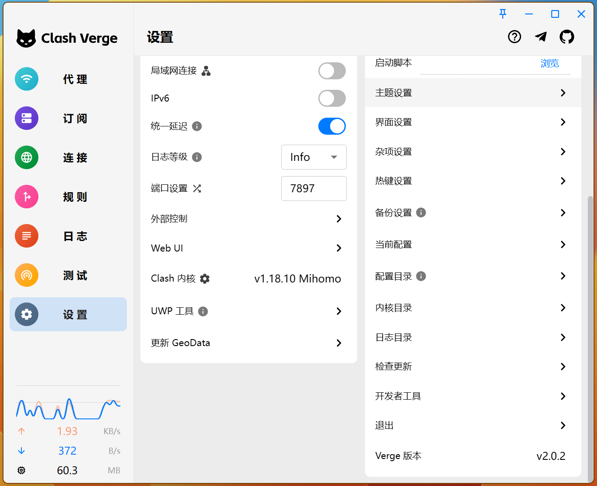
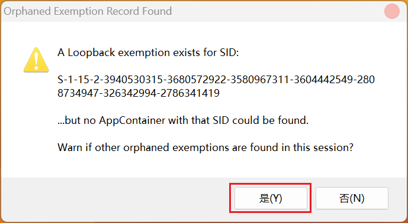
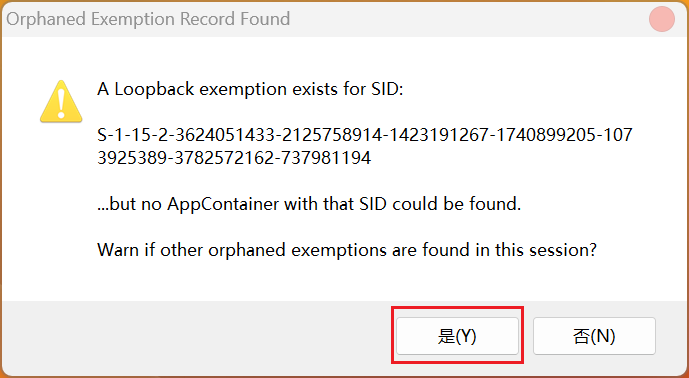
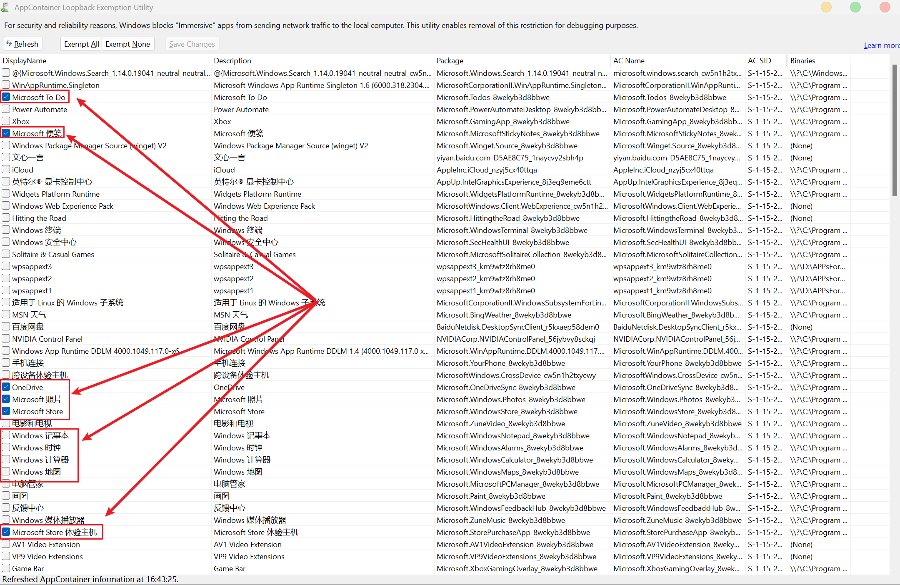
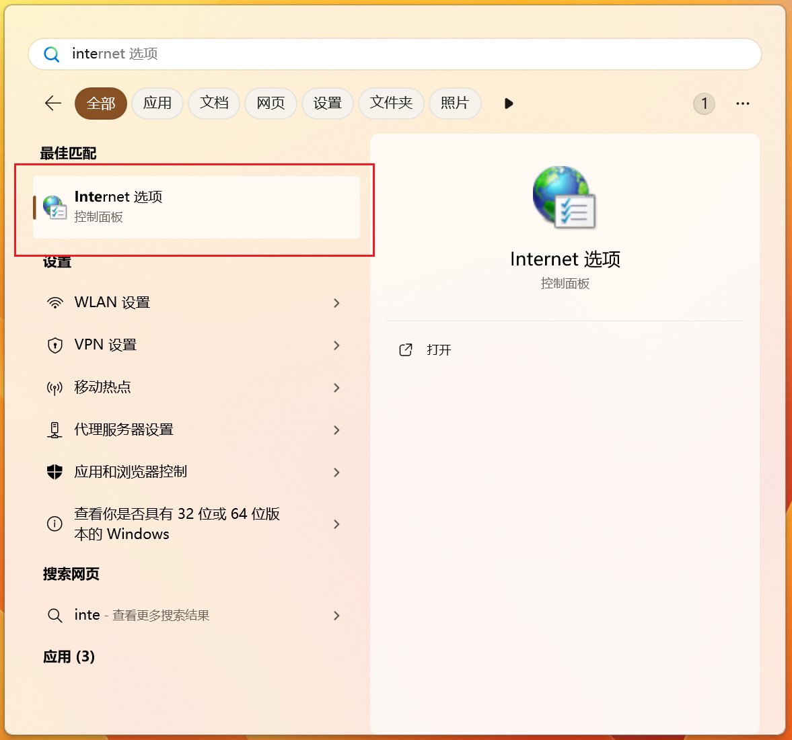
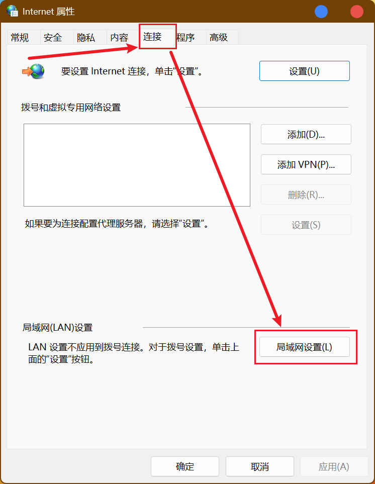
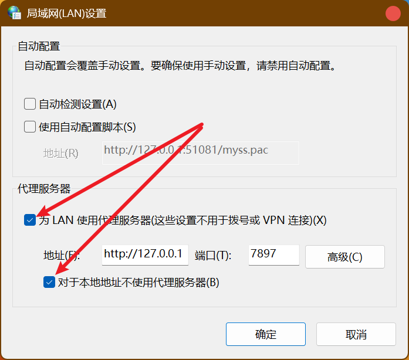

# Microsoft Todo无法同步问题

## 写在前面

此问题大多出现在**访问过外网**的用户，当然，对于Github频繁使用者，必然少不了用梯子之类。

笔者所用为 Clash Verge➕ [飞机场节点](../../🛠️实用工具/📡科学上网/飞机场节点对比.md) 的策略。如果你的科学上网方案与我不同，也不用慌张，解决方案基本类似。

值得一提的是，此篇也同样适用于：Microsoft Store无法打开、便签无法同步，Onenote无法登录之类的情况。因为「从 Windows 8 开始，Windows便对UWP应用直接访问本地主机的网络服务进行了限制」。

## 解决方案

### 对 Clash Verge 用户

<h4>第一步</h4>

找到clash中设置 --> UMP 工具。

<h4>第二步</h4>

打开 UMP 工具，弹窗全部点确认。

<h4>第三步</h4>

在弹出的窗口左侧选择你想要调整的应用，⬜ `==>` ✅即可。

### 对其它用户

::: info 作者说
目前笔者只能提供临时办法，若您有好的解决方案，欢迎来[本仓库](https://github.com/get1024/get1024.github.io) `fork` 并提出 `PR`。
:::

<h4>第一步</h4>

按 Windows 徽标键，搜索 `Internet选项` 并打开。

<h4>第二步</h4>

连接 `==>` 局域网设置。

<h4>第三步</h4>

关闭对勾选项，☑️ `==>` ⬜即可。

## 检验效果

重新进入您期望的程序，可见问题解决。