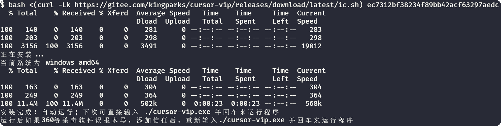
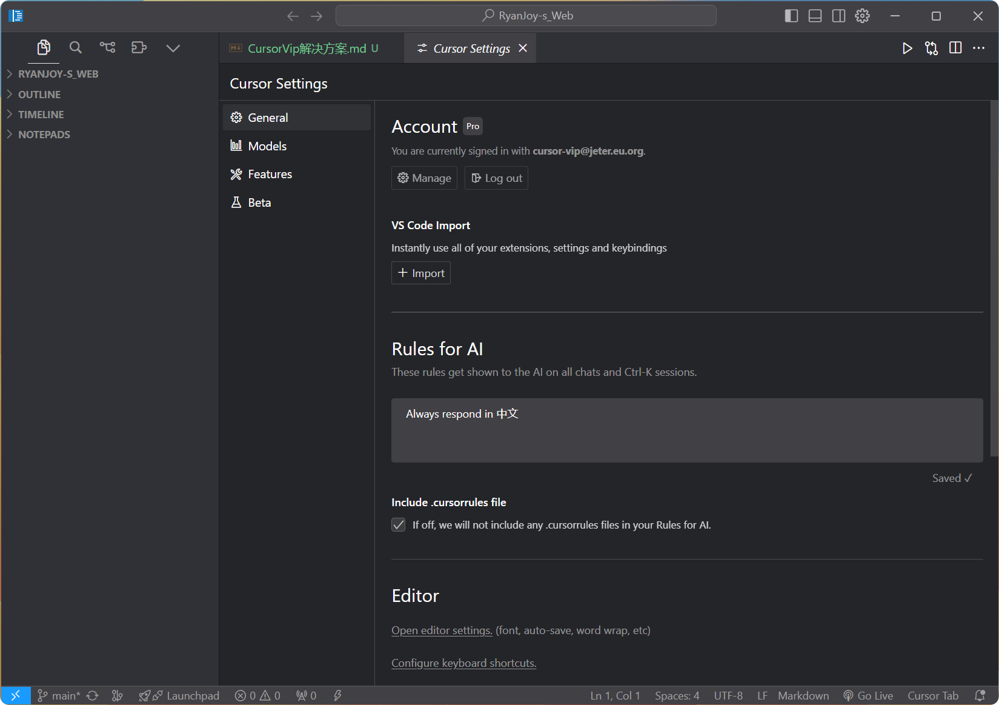

# Cursor Vip解决方案

## 前期准备

- 下载 [Cursor](https://www.cursor.com/)。进入官网，一键安装。


- 下载 [git](https://git-scm.com/)。如安装有困难，见 git 安装教程。

## 一键 VIP

桌面右键，选择 `git bash here`

在窗口中粘贴下列命令，等待运行即可

```sh [git bash]
bash <(curl -Lk https://gitee.com/kingparks/cursor-vip/releases/download/latest/ic.sh) ec7312bf38234f89bb42acf63297aedc
```

运行成功如图



在 Cursor 中也可见，登录为 Vip 用户



## 注意事项

在 Cursor 使用过程中，**请勿**关闭 `git bash` UI 窗口！

`Cursor Vip` 仅首次使用需要安装，之后只需要在 `git bash` 执行：

```sh [git bash]
./cursor-vip.exe
```

键入上述命令后，回车执行即可。