# 个人博客搭建、使用最佳解决方案

## SSG 选择

目前用户较多的有 [Hexo](https://hexo.io/zh-cn/)，[Hugo](https://gohugo.io/)，[Gatsby](https://www.gatsbyjs.com/)，[VuePress](https://vuepress.vuejs.org/zh/)，[VitePress](https://vitepress.dev/zh/)，[Jekyll](https://jekyllrb.com/)。另外还有 [Pelican](https://getpelican.com/)，[Middleman](https://middlemanapp.com/)，[MkDocs](https://www.mkdocs.org/)，[docsify](https://docsify.js.org/#/) 等……

毫无疑问，如果你正在看这篇文档，说明你和我刚开始搭建博客时有一样的忧虑。

在这里呢，显而易见我的选择是 `Vitepress` ，吸引我的地方：一是它样式较为正式，颇具「项目说明书」「Wiki 文档」「使用手册」「项目文书」这样的特点；二是结构简单，布局清晰；三是用户群体庞大，方便交流。

不过其他框架也都大差不差，读者可根据自己的喜好自行选择。

## 博客板块

1. **🏠首页**：这是用户访问博客时首先看到的页面。它应该包含博客的基本介绍、分类导航以及关于博主或博客的简要介绍。
2. **📒笔记**：这是博客系统的核心板块，用于展示博主的文章。可以进一步细分为不同的分类或标签，方便用户根据兴趣浏览。
	- **生活技能**
	- **个人项目**
	- **操作系统**
	- **专业技能**
	- **反思和总结**
	- **实用工具**
3. **关于我**：这个板块可以介绍博主的基本信息、兴趣爱好、职业背景等，有助于读者更好地了解博主和博客的定位。
4. **归档/历史文章**：按照时间顺序或主题分类展示过去的文章，方便读者查找和回顾。
5. **评论区**：提供留言功能，方便读者与博主互动，提出问题或建议。
6. ~~**友情链接/推荐资源**：列出其他相关博客或网站的链接，可以扩大博主的社交网络，也可以为读者提供更多有价值的信息。~~
7. **搜索功能**：提供搜索功能，方便用户快速找到感兴趣的内容。

## 博客使用

这里比较推荐的使用方案是 `Obsidian` ➕ `Vitepress` 的方案。例如我现在在这里进行文档编写，在 VScode 里面进行版本控制和代码提交。

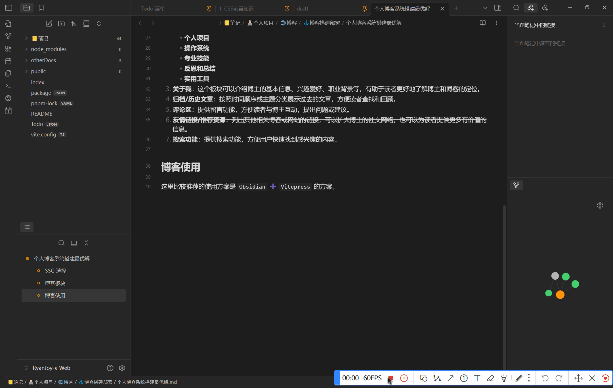

这里的使用方案也是我在踩了无数的坑、重构了无数次博客布局后摸索出来的，下面给大家做一下分享。

### Obsidian配置

#### 文件与链接

Obsidian 提供 Wiki 双链 ( `[[双链]]` ) 和原生 `Markdown链接` 的两种链接方式，Wiki 双链在 Obsidian 使用当然是十分顺滑自然的，但是这一设置显著削弱了博客系统的**跨平台性和健壮性**。

在最开始我为了解决这一问题，采取了大佬 [@nekomeowww (Neko)](https://github.com/nekomeowww) 的插件方案： [双向链接 \| Nólëbase 集成](https://nolebase-integrations.ayaka.io/pages/zh-CN/integrations/markdown-it-bi-directional-links/) 来解决。在一开始，确实拥有了不错的体验：

- 在 Obsidian 编写文档创建链接方便；
- `Vitepress` 在插件的作用下也能成功识别并渲染
- ……

<span class="marker-evy">但是也存在问题</span>。

我们在写文档的时候，为了保证成品效果，有时候只看 Obsidian 端的效果是不准确的，这里以当前界面为示例，如图：

|                  **Obsidian**                  |               **Vitepress**渲染结果                |
| :--------------------------------------------: | :--------------------------------------------: |
| 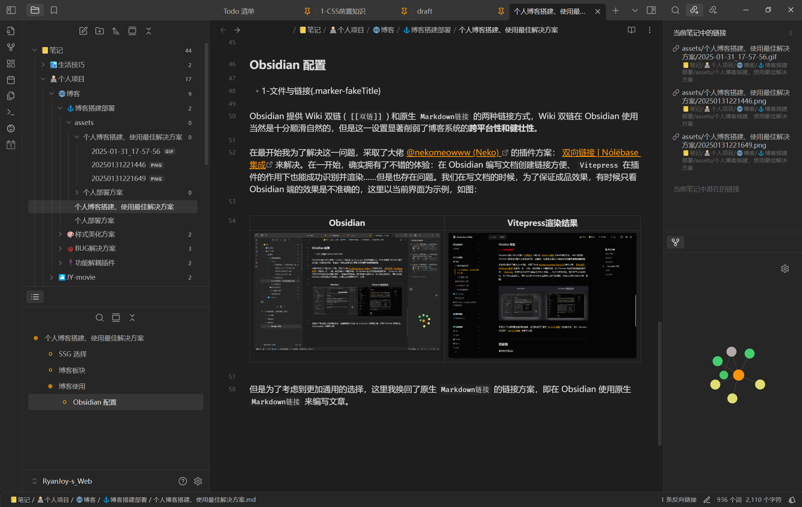 | 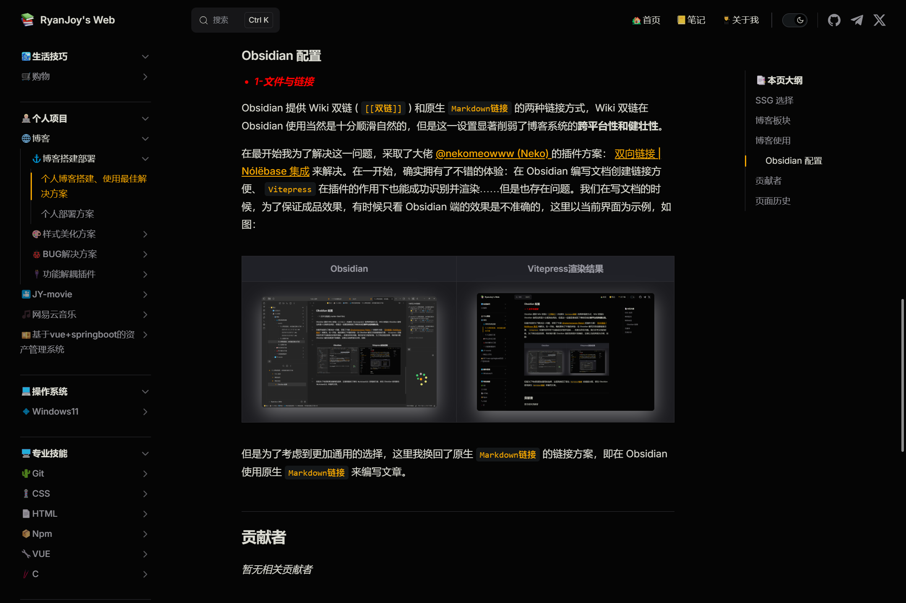 |

所以我们会不停的切换到浏览器页面查看前端渲染完成的效果。{.marker-underline}

但这就引出了前文提到的问题： [双向链接 \| Nólëbase 集成](https://nolebase-integrations.ayaka.io/pages/zh-CN/integrations/markdown-it-bi-directional-links/) 查看方案只能保证 `Vitepress` 在部署到服务器上以后我们看到的链接引用是正确的，但是如果我们直接在 `Markdown` 文档中使用 `![[]]` 写法，只会在 Obsidian 端看到效果，而前端 `dev` 界面未能成功渲染。如图所示：

| **引用方式**                                  |                  **Obsidian**                  |               `Vitepress` 前端 DEV               |
| ----------------------------------------- | :--------------------------------------------: | :--------------------------------------------: |
| `![[assets/个人博客搭建、使用最佳解决方案/RyanJoy.jpg]]` | 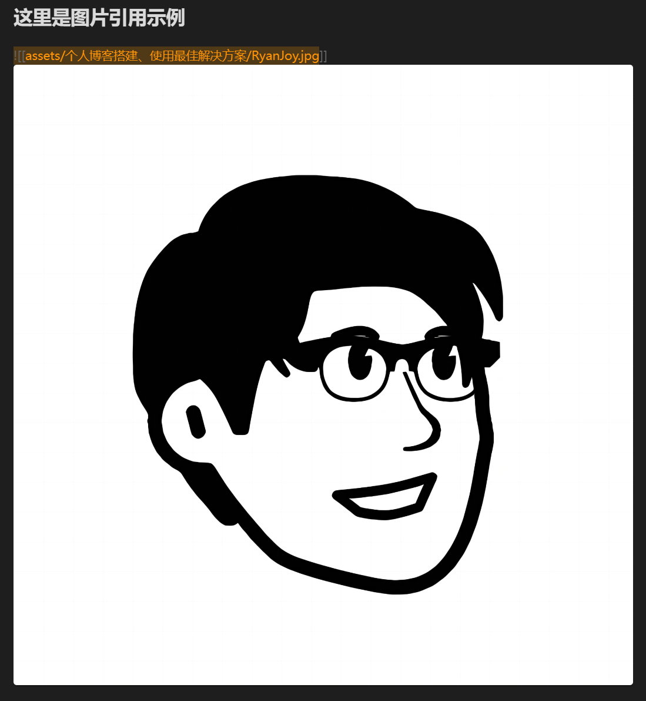 | 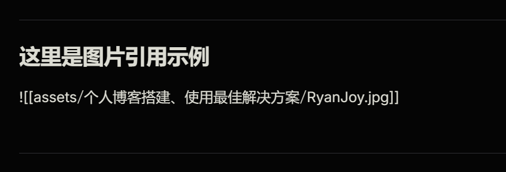 |
| `` | 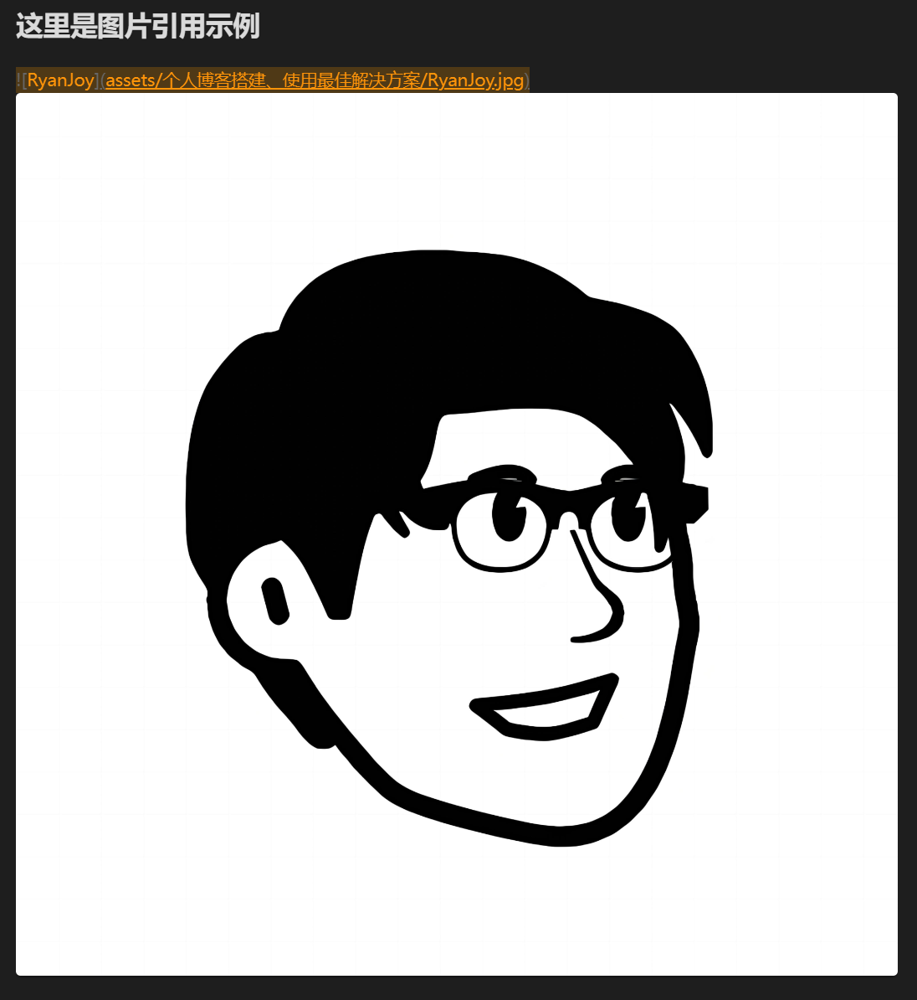 |  |

所以为了考虑到更加适合开发的情形，这里我换回了原生 `Markdown链接` 的方案。{.marker-fakeTitle}

在此基础之上，为了优化开发体验、增强博客系统健壮性，这里又增添了几个插件：

- [Custom Attachment Location]( obsidian://show-plugin?id=obsidian-custom-attachment-location )：一个自动修改附件名称、存储位置的插件。

	插件配置如下：

	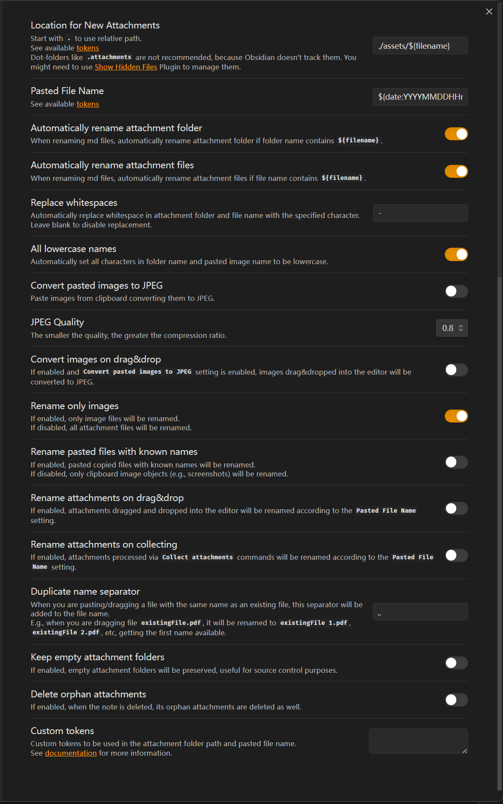

	系统配置如下：

	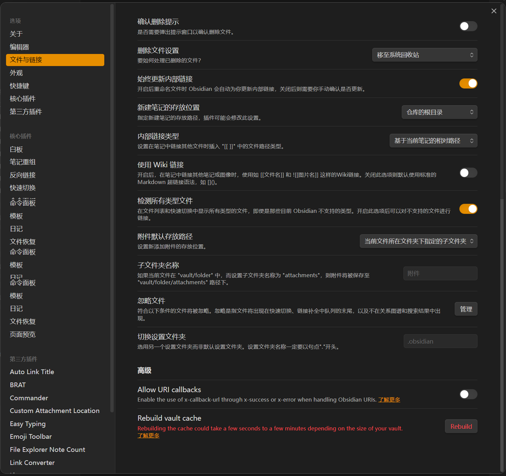

	在这样配置之后，每次 `粘贴` 图片到编辑区域中，插件便会自动的给图片命名，并把其放入 `./assets/${filename}` 路径中。如图所示：

	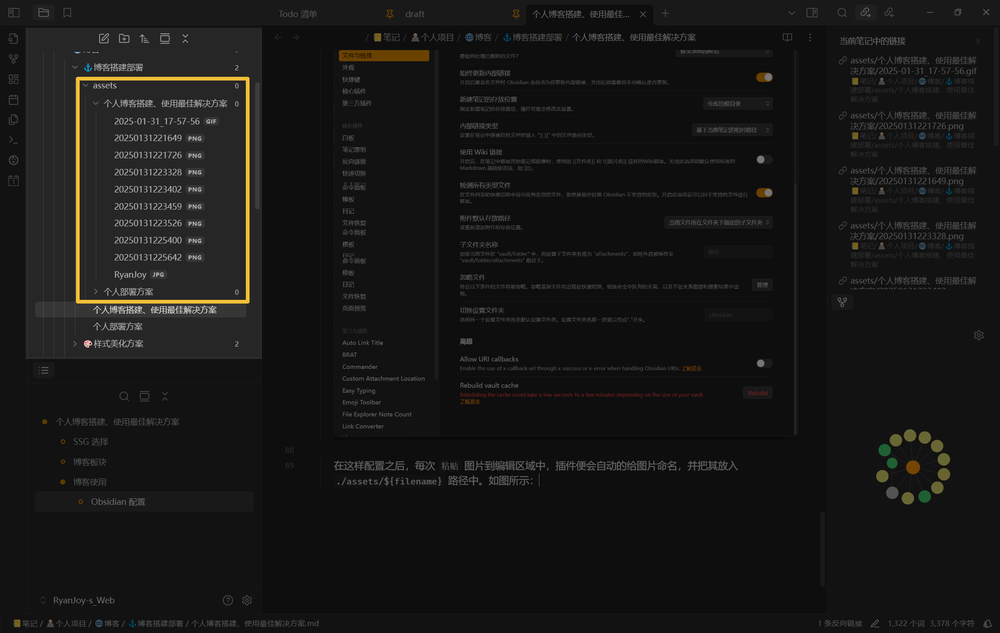

	安装之后，「已经存在的图片」不会自动被处理。如果你希望全部图片都按照上述图片所示的结构存储，执行以下步骤：

	1. 在 Obsidian 编辑页面，按 `Ctrl+p` ，换出命令面板；
	2. 在命令面板输入 `custom attachment location` ，出现选项：

		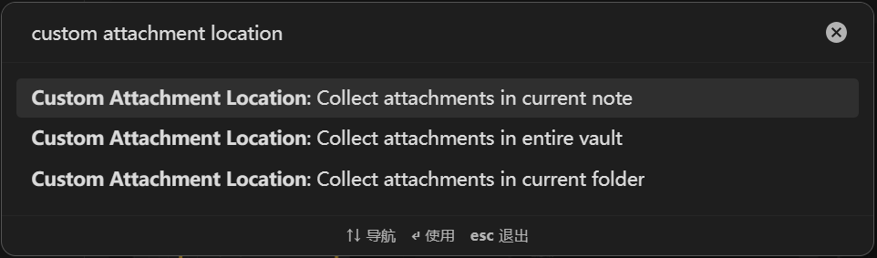

		第一个是只对**当前文件**的附件进行自动化处理；第二个是对**整个仓库**的附件进行自动化处理；第三个是对**当前文件所在文件夹**的附件进行自动化处理。选择你想要处理的范围即可。

		**这里我直接选了第二个。**

		::: warning 注意！！！

		数据无价！记得提前备份再进行操作！

		:::

		执行第二个命令之后，会发现原本存储图片的位置已经自动清除，现在所有图片已经被移动到 <span class="marker-evy">**指定配置**</span> 的位置

	3. 后续就基本不再会使用「步骤 2」的命令了，你`粘贴`的图片会自动被处理。

- [Obsidian Link Converter]( obsidian://show-plugin?id=obsidian-link-converter )：一个自动扫描全局链接的插件，把原本链接转化为你所指定的形式。

	插件配置如下：

	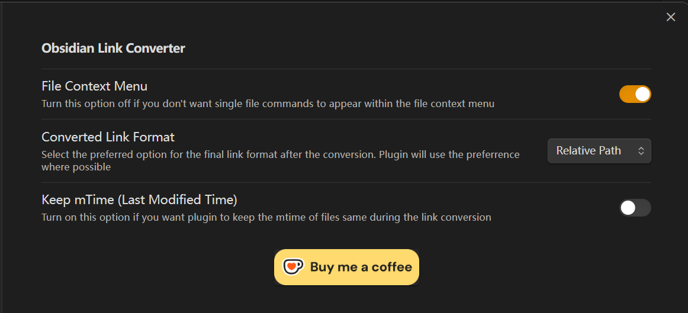

	这一插件主要用来辅助 [Custom Attachment Location](obsidian://show-plugin?id=obsidian-custom-attachment-location) 插件的使用。在经过 [Custom Attachment Location](obsidian://show-plugin?id=obsidian-custom-attachment-location) 的命令之后，所有附件被移动到当前文件的父文件夹下，毫无疑问此位置更适合使用相对路径， `Vitepress` [官方文档](https://vitepress.dev/zh/guide/asset-handling#referencing-static-assets) 也是这么建议我们的：

	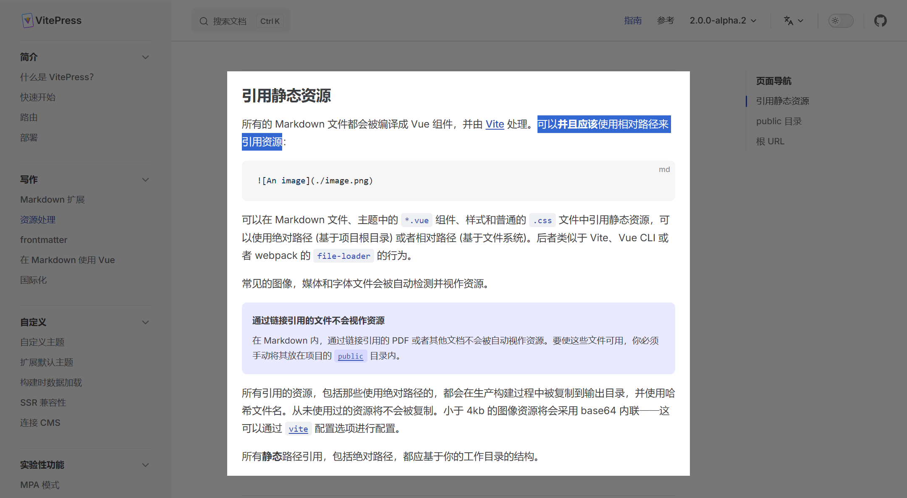

	因此我们可以利用这一插件进行全局链接的转换，步骤如下：

	1. 在 Obsidian 编辑页面，按 `Ctrl+p` ，换出命令面板；
	2. 在控制面板输入 `Link Converter` ，弹出窗口显示如下：

		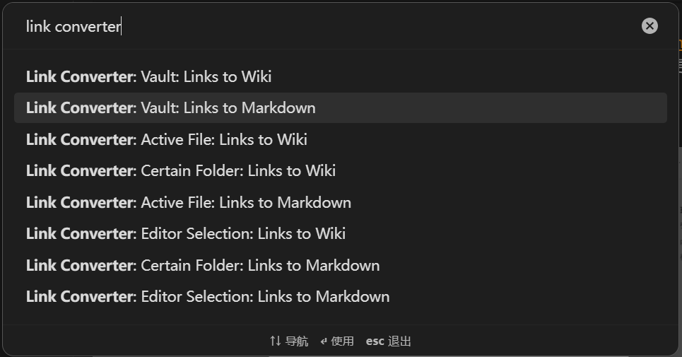

		选择第二个。

	3. 等待命令执行完毕即可。

#### 文件配置

每一份文件都需要增加 `frontmatter` 项，基本内容如下：

```markdown [example.md]
---
title:  文章标题
createAt:  YYYY-MM-DD HH:mm:ss
updateAt:  YYYY-MM-DD HH:mm:ss
---
```

这一配置不仅能够显示文档的历史，也为 [Vitepress自动生成索引页](../🔌功能解耦插件/Vitepress自动生成索引页.md) 提供了方便。这一配置也可以通过插件实现，这里推荐 [Linter](obsidian://show-plugin?id=obsidian-linter) 。插件时间戳配置如下：

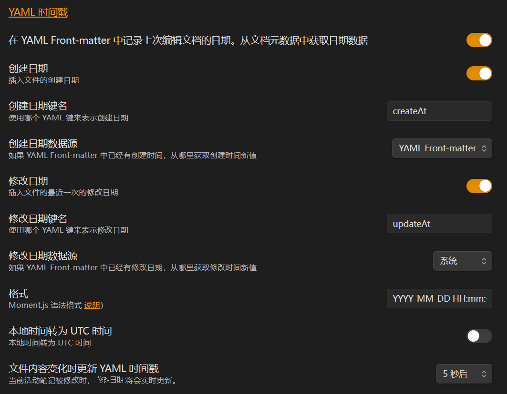

其余默认设置即可。这样你每次创建文件、编辑文件便会自动更新 `frontmatter` 中的键值对。

### 文档编写

在经过了 [Obsidian 配置](#obsidian配置) 之后，你就能够按照我的开发模式进行文档撰写了。

主要开发任务分配给 Obsidian，项目版本控制交给 VScode，并通过浏览器查看 Vitepress 渲染结果。这是一个十分自然的开发过程，快去开启你的愉快探索吧！

## 🎊写在最后

可能说「最佳」确实有些标题党，但是不可否认的是，这确实是我体验下来最舒服的书写体验。良好的书写工具和环境无疑会促进你的输出，我个人对现在的状态还是比较满意的。

如果您对此篇有所建议，欢迎评论留言；如果您愿意贡献此篇，欢迎点击页面右上角 Github 图标，到本仓库提出 `PR` 。