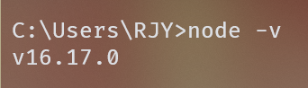
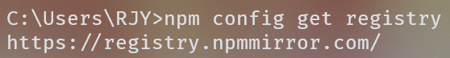
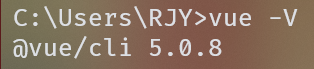
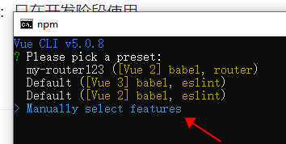
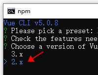
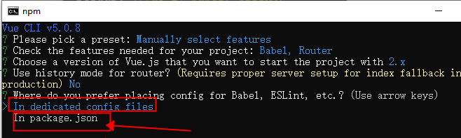
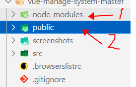
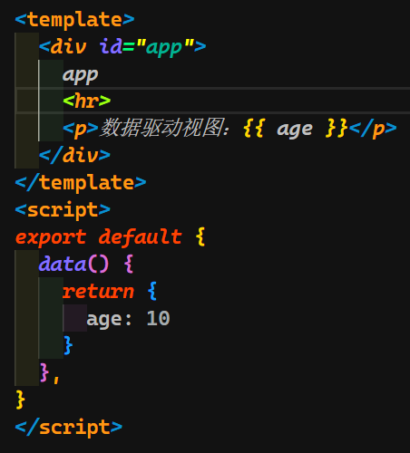

# 第 1 天——前端

## 环境安装

### [Node.js](https://nodejs.org/en) 安装

::: tip

可以选择14、16版本，我们以14版本为例。 `npm` 会和 `nodejs` 一同安装。

:::

- 安装完毕后，配置环境变量（系统变量 --> path）。
- 验证是否配置成功： `node -v` 
	

- 镜像配置：

	查看镜像： 

	```sh [powershell]
	npm config get registry
	``` 

	 

	若结果与图片不符，则配置镜像

	```sh [powershell]
	npm config set registry=https://registry.npmmirror.com/
	```

	再次查看镜像，结果正确即可。

### [Vue CLI](https://cli.vuejs.org/zh/) 安装

- 安装命令： `npm install -g @vue/cli` 3. 验证是否安装成功： ： `vue -V` 
	

#### vue-cli 是什么？

- 是一种基于 vue 的脚手架（比喻）；
- 可以保证代码兼容性；
- 将项目打包，删除冗杂的注释；
- 可以自动将项目混淆，降低已上线项目可读性（加密）。

#### vue-cli 和 [Vue](https://cn.vuejs.org/) 的区别？

- Vue 是一个 `js` 框架；
- Vue-cli 是对 vue 的封装，内置了很多插件。

### vscode 安装配置

- 安装 vscode
- 安装 vue vscode snippets 插件，`vbase` 命令即可快速构建出 `vue` 项目结构

## 参考项目

<Linkcard url="https://github.com/lin-xin/vue-manage-system" title="后台管理系统"  description="基于Vue3、Element Plus、typescript搭建" logo="/components/lists/Vue.png"/>

- 使用方法：
	- 下载项目；
	- 解压，进入根目录，运行 `cmd` ；
	- 执行 `npm install` 下载**依赖**；
	- 启动项目：cmd 执行 `npm run dev`

## 创建项目

### 命令行创建项目

- 命令： `vue create vue01`






### 非 spa 项目

- 引入 `vue.js`

- Vue-cli 项目目录结构



::: info

`node_modules` --> 项目依赖包；

`public` --> 项目静态资源

:::

## vue 基本使用

### 数据驱动视图 

 

.png)

### 视图驱动数据 

.png) 

.png)

### 双向绑定 

.png) 

.png)

### 事件添加

- 以登录按钮为例
- 按钮添加
::: code-group

```vue [vue]
<button @click="onLogin">登录</button>
```

:::

- 事件添加
::: code-group

```vue [vue]
<script>
export default{
	methods:{
		onLogin(){
			[函数体]
		}
	},
}
</script>
```

:::

.png) 

.png)

### class 样式控制

#### Template

```vue [vue]
操作样式
<button @click="isActive = !isActive" :class="{ active: isActive }">点击切换选中</button>
```

- click 事件：每次点击 isActive 值取反；
- class 中会接收当前的 isActive 值，赋给 active 选择器，从而选择是否执行 style 中的 `.active` 样式。

#### Script

```vue [vue]
data(){
	return{
		isActive:false,
	}
}
```

- 默认给 isActive 一个 false，即初始不显示 `.active` 的样式。

#### Style

```vue [vue]
<style scoped>
	.active{
		[设置属性，用作激活active后的样式]
	}
</style>
```

- `.active` 是样式选择器，用来控制 class 为 active 的控件的样式。

### 组件（components）使用

#### 组件组成

- 组成：vue 组件由 3 部分组成 `template` 、`script`、 `style` 。Template 只能有一个根节点，且此组件必须存在。
- 组件文件夹
	.png)

#### 组件使用步骤

- 定义组件；
	.png)
- 导入组件（es 6 ：import）；
	.png)**一定要放在 `<script></script>` 标签最前端**
- 注册组件；
	.png)
- 使用组件。
	.png)

### 路由

#### 路由配置

- 首先导入路由
	- 方法一：命令行创建项目时就把路由勾选上去；
	- 方法二：手动安装 `npm install vue-router@3.5.1 --save `
- 配置文件 
	.png)
- 两种加载方式
	1. 懒加载：某页面**不被访问**时就**不**加载。
	2. 直接加载：首页一般都直接加载。
	.png)

#### 跳转使用

- 定义 `.vue` 文件作为一个页面组件 
	.png)**页面组件中，`<div>` 的 `<class>` 属性不需要与 `index.js` 和 `App.vue` 中的路径值相同**
- 路由配置文件 `index.js` 中进行对应配置 
	.png) `path` 是必须注明的；`name` 不是必须的，但推荐写出，用来指明 `router` 的目的地。
-  `App.vue` 中使用 `router-link` 进行 进行跳 进行 进行跳转， uter-view  
	.png) 
	`to` 值需与 `index.js` 文件中的 `path` 值对应

## element-ui 框架

### 基本使用

- 官网： [Element - The world's most popular Vue UI framework](https://element.eleme.cn/#/zh-CN)
- 安装：

	```sh [powershell]
	npm i element-ui -S
	```

- 导入：
	.png)
- 测试是否生效：
	.png)

### 重要组件介绍

#### 图标

- 矢量图标，放大不失真，可以自由设置颜色

#### 下拉选择

- 用户看到的，和实际背后进行的逻辑数据不一样
- 比如数据字典如图所示：
	 .png)
