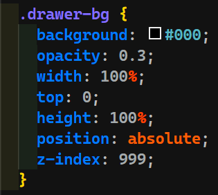
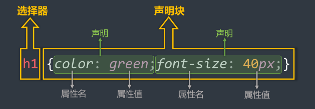

# CSS 前置知识

::: tip 作者说

由于受 Vitepress 和 Markdown 的限制，为了更好的学习体验，笔者提供了本笔记的 PDF 版本：

- [点击查看/下载**CSS2**完整笔记](/PDFs/CSS2笔记.pdf)
- [点击查看/下载**CSS3**完整笔记](/PDFs/CSS3笔记.pdf)
:::

## 简介

- `CSS` 全称为**层叠样式表**（`Cascading Style Sheets`）；
	- 层叠：一层一层“铺”上去；
	- 样式：文字大小、颜色、背景……；
	- 表：列表。
	- 如图所示：
		
- `CSS` 也是一种标记语言，用于给 `HTML` 设置样式。
- `HTML` 搭建结构，`CSS` 添加样式，实现了**结构样式的分离**。

## 三种样式表

### 行内样式

- 写在空间标签的 `style` 属性中，又称内联样式。

```HTML [example.html]
<h1 style="color:red;font-style:italic;"">这是一个内联样式举例</h1>
```

- 效果前后对比
	- 前 `<h1>这是一个内联样式举例</h1>`<h1>这是一个内联样式举例</h1>
	- 后 `<h1 style="color:red;font-style:italic;">这是一个内联样式举例</h1>`<h1 style="color:red;font-style:italic;">这是一个内联样式举例</h1>

<span class="marker-underline">注意点</span>

- **`HTML` 的名值对是“名=值”；`CSS` 的名值对是“名: 值;”；**
- 行内样式表，**只能控制当前标签**的样式，对其他标签无效。
- 优先级高，会覆盖在 `css` 文件中对同元素定义的样式。

<span class="marker-underline">存在的问题</span>

- 不能复用；
- **没有体现结构与样式分离**；
- 可维护性差；

### 内部样式

- 写在 `HTML` 页面内部，将所有的 `CSS` 代码汇总，单独放在 `<style>` 标签内部；

```HTML [example.html]
<style>
	h1 {
		color:red;
		font-size:60px;
	}
</style>
```

<span class="marker-underline">注意点</span>

- `<style>` 标签理论上可以放在 `HTML` 文件的任意位置，但是**推荐放在 `<head>` 标签内部**；

<span class="marker-underline">存在的问题</span>

- **没有完全实现样式与结构分离**；
- 同一个 `HTML` 文件内可以对样式进行复用，但是多个 `HTML` 文件无法复用样式。

<span class="marker-underline">优势</span>

- 可以复用；
- 代码结构清晰。

### 外部样式

- 写在单独的 `.css` 文件中，随后在 `HTML` 文件中引入使用；
- 首先新建一个 `[css文件名称].css` 文件，并写入以下内容：

```css [example.css]
h1 {
	color:red;
	font-size:60px;
}
```

- 再在 `HTML` 文件中引入该样式文件：

```HTML [example.html]
<link rel="stylesheet" href="~/example.css">
```

<span class="marker-underline">注意点</span>

- `<link>` 标签要写在 `<head>` 标签中；
- `<link>` 标签属性说明：
	- `href`：指明引入的文档位置；
	- `rel`：`relation` 的简写，说明引入的文档与当前文档的关系；

<span class="marker-underline">优势</span>

- 可以复用；
- 代码结构清晰；
- 可触发浏览器的缓存机制，提高访问速度；
- 实现了**结构与样式的完全分离**；
- 是实际开发中最常使用的方式；

## 样式表优先级

- 优先级规则：行内样式 `>` 内部样式 `=` 外部样式

>[!TIP] 备注 
>1. 内部样式、外部样式，这两者的优先级相同，且：后面的会覆盖前面的（**后来居上**）
> 2. 同一个样式表中，优先级也和编写顺序有关，且：后面的会覆盖前面的 （**后来居上**）
> 3. “后来居上”前提是：同一种选择器。对不同种选择器之间，优先级规则详见 [选择器的优先级——权重](2-CSS选择器详述.md#选择器的优先级——权重)。

## CSS 语法规范

### 样式写法

- *选择器*：找到要添加样式的元素；
- *声明块*：设置具体的样式（声明块是由一个或多个声明组成的），声明的格式为：**`属性名:属性值;`**；

> [!TIP] 备注
> 1. 最后一个声明后面的 `;` 理论上是可以省略的，推荐写上；
> 2. 选择器与声明块之间、属性名与属性值之间，均有一个空格，理论上可以省略，但推荐写上。


### 注释的写法

<p></p>

```css [example.css]
/* 给h1元素添加样式 */
h1 {
	/* 设置文字颜色 */
	color:red;
	/* 设置文字大小 */
	font-size:60px;
}
```

## CSS 代码风格

### 展开风格

- 开发时推荐，便于维护和调试

```css [example.css]
h1 {
	color:red;
	font-size:60px;
}
```

### 紧凑风格

- 项目上线时推荐，可以减少文件体积

```css [example.css]
h1 {color:red;font-size:60px;}
```

::: TIP 备注

项目上线时，会使用工具 (`webpack`) 把「展开风格」的代码转换为「紧凑风格」的代码，这样可以减少文件体积，节约网络流量，同时也能让用户打开网页时速度更快。

:::

## CSS 三大特性

### 层叠性

- 概念：如果发生了样式冲突，那就会根据一定的规则（选择器优先级），进行样式的层叠（覆盖）。

::: details 什么是样式冲突？

元素的 **同一个样式名**，被设置了 **不同的值**，这就是冲突 [^1] 。

:::

### 继承性

- 概念：元素会自动拥有 **其父元素**，或 **其祖先元素** 上所设置的 **某些样式**。
- 规则：优先继承 **离得近** 的。
- 常见的可继承属性：`text-??` ， `font-??` ， `line-??` ， `color` ……

### 优先级

- 简单即：`!important` `>` 行内样式 `>` ID 选择器 `>` 类选择器 `>` 元素选择器 `>` * `>` 继承的样式。
- 详细即：需要计算权重。计算权重时需要注意：**并集选择器的每一个部分是分开算的！**

[^1]:demo