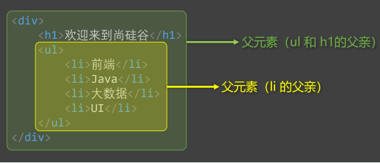
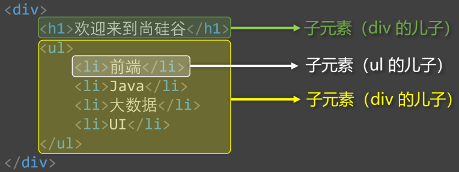
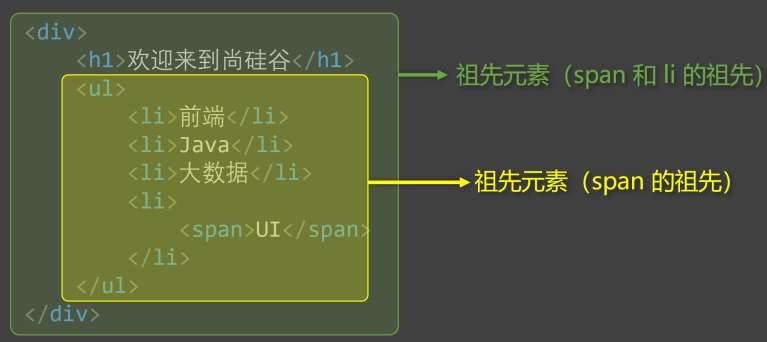
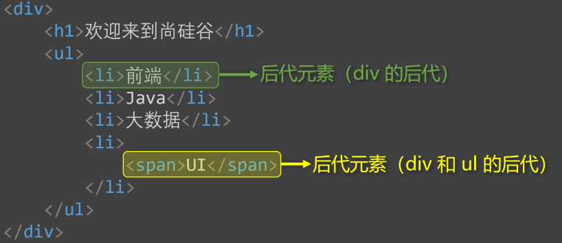
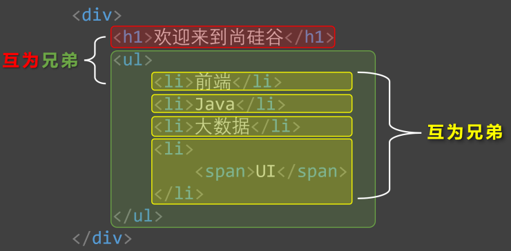
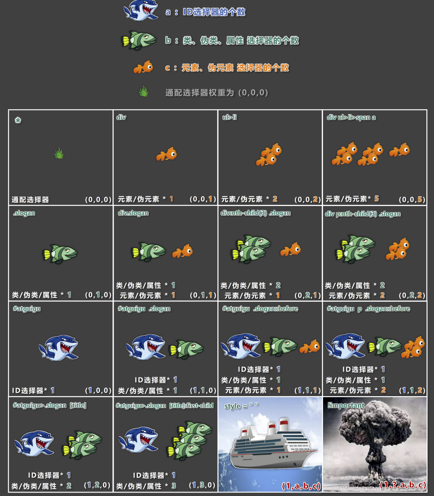

# CSS 选择器详述

## CSS 基本选择器

### 通配选择器

- 作用：可以选中所有的 `HTML` 元素；
- 语法：

```css [example.css]
* {
	属性明:属性值;
}
```

- 举例：

```css [example.css]
/* 选中所有元素 */
* {
	color:orange;
	font-size:60px;
}
```

> [!TIP] 备注
> 目前来看通配选择器几乎不使用，但在 **清除样式** 时，对我们有很大帮助。

### 元素选择器

- 作用：为页面中**某种元素**统一设置样式；
- 语法：

```css [example.css]
标签名 {
	属性明:属性值;
}
```

- 举例：

```css [example.css]
/* 选中所有h1元素 */
h1 {
	color:red;
	font-size:60px;
}
/* 选中所有p元素 */
p {
	color:red;
	font-size:60px;
}
```

>[!TIP] 备注
>元素选择器无法实现**差异化设置**，譬如上面所示，所有 `p` 元素效果都一致。

### 类选择器

- 作用：根据元素的 `class` 值，来选中**这些**元素；
- 语法：

```css [example.css]
.类名 {
	属性明:属性值;
}
```

- 举例：

```css [example.css]
/* 选中所有class值为speak的元素 */
.speak {
	color:red;
	font-size:60px;
}
```

>[!TIP] 备注
>1. 元素的 `class` 属性值不带 `.` ，但 `CSS` 类选择器要带 `.` 。
>2. `class` 值，是我们自定义的，按照标准：
>	- 不能使用「纯」数字、中文；
>	- 尽量使用数字和英文的组合；
>	- 若有多个单词组成，通过 `-` 连接，如： `left-menu` ；
>	- 命名要做到**见名知意**；
>3. 一个元素不能写多个 `class` 属性，下面是错误示例： `<h1 class="speak" class="big">hello</h1>` ; 同名属性不能重复，否则遵循后来居上原则。
>4. 一个元素的 `class` 可以有多个值，不同值之间用空格隔开： `<h1 class="speak big">hello</h1>` 。

### `id` 选择器

- 作用：根据元素的 `id` 属性值，来**精准**的选中**某个**元素；
- 语法：

```css [example.css]
#id值 {
	属性明:属性值;
}
```

- 举例：

```css [example.css]
/* 选中id值为earth的那个元素 */
#earth {
	color:red;
	font-size:60px;
}
```

>[!TIP] 备注
>1. `id` 属性值，标准：
>	1. 尽量由字母、数字、下划线 ( `_` )、短杠 ( `-` ) 组成；
>	2. 以字母开头；
>	3. **不要包含空格**；
>	4. 区分大小写；
>2. 一个元素只能拥有一个 `id` 属性，多个元素的 `id` 属性值不能相同；
>3. 一个元素可以同时拥有 `id` 和 `class` 属性。

## CSS 复合选择器

>[!WARNING] 什么是复合选择器？
> 1. 复合选择器建立在基本选择器基础上，由多个基础选择器通过不同方式组合而成；
> 2. 复合选择器可以在复杂结构中，快速而准确的选中元素。

### 交集选择器

- 作用：选中同时符合多个条件的元素。<span class="marker-underline">交集有**并且**的意思，即：**既……又……**。</span>

- 语法：**选择器之间没有任何符号/空格**

```css [example.css]
选择器1选择器2选择器3{
	属性名:属性值;
}
```

- 举例：

```css [example.css]
/* 选中类名为beauty的p元素，为此种写法用的非常多 */
p.beauty{
	color:blue;
}
/* 选中类名包含rich和beauty的元素 */
.rich.beauty{
	color:red;
	font-size:60px;
}
```

> [!TIP] 备注
> 1. **有标签名出现，标签名必须写在前面；**
> 2. `id` 选择器、通配选择器，理论上可以作为交集的条件，但实际应用中几乎不用——因为 `id` 唯一，通配包含全部，实际上没有意义；
> 3. 交集选择器中不可能出现两个元素选择器——因为一个元素只能是一种既定的类型；
> 4. 用的最多的交集选择器是：元素选择器配合类名选择器，例如： `p.beauty` 。

### 并集选择器

- 作用：选中多个选择器对应的元素，又称：**分组选择器**。<span class="marker-underline">并集就是**或者**的意思，即：**要么……要么……**</span>

- 语法：多个选择器通过 `,` 连接，此处 `,` 的含义就是**或**

```css [example.css]
选择器1,
选择器2,
选择器3 {
	属性明:属性值;
}
```

- 举例：

```css [example.css]
/* 选中id值为peiqi，或类名是rich，或类名为beauty的元素 */
#peiqi,
.rich,
.beauty {
	color:red;
	font-size:60px;
}
```

>[!TIP] 备注
>1. 并集选择器我们一般竖着写；
>2. **任何形式的选择器**，都可以作为并集选择器的一部分；
>3. 并集选择器通常用于集体声明，可以缩小样式表体积。

### HTML 元素之间的关系

- 分为：父元素、祖先元素；子元素、后代元素；兄弟元素。

#### 父元素

- **直接**包裹某个元素的元素，就是该元素的父元素。 

#### 子元素

- **被**父元素**直接**包裹的元素 (也称：儿子元素)。 

#### 祖先元素

- 元素本身所有的外层元素，都是祖先。 

#### 后代元素

- 元素本身所有的内层元素，都是后代。 

#### 兄弟元素

- 父元素相同的元素，互为兄弟元素。 

### 后代选择器

- 作用：选中指定元素中，符合要求的**后代元素**。
- 语法：多个选择器通过「空格」连接，此处的含义就是**后代**，即"XXX 中的……"

```css [example.css]
选择器1 选择器2 选择器3 {
	属性名:属性值;
}
```

- 举例：

```css [example.css]
/* 选中ul中的所有li */
ul li {
	color:red;
}
/* 选中ul中所有li中的a */
ul li a {
	color:red;
}
/* 选中类名为subject的元素中的所有li */
.subject li {
	color:red;
}

/* 选中类名为subject的元素中的所有类名为front-end的li */
.subject .front-end li {
	color:red;
}
```

>[!TIP] 备注
>1. 选择器可以是任意一种基本选择器的组合；
>2. 后代选择器最终选择的是后代，不选中祖先；
>3. 儿子、孙子、重孙子……都算是后代；
>4. 结构一定要符合之前讲的 `HTML` 嵌套要求，例如：不能 `p` 中写 `h1~h6` 。（详见 [排版标签](../📄HTML/1-HTML4.md#排版标签)）

### 子代选择器

- 作用：选中指定元素中，符合要求的**子元素**。
- 语法：多个选择器通过 `>` 链接。

```css [example.css]
选择器1>选择器2>选择器3……>选择器n {
	属性名:属性值;
}
```

- 举例：

```css [example.css]
/* div中的子代a元素 */
div>a {
	color:red;
}
/* 类名为person的元素中的子代a元素 */
.person>a {
	color:red;
}
```

>[!TIP] 备注
>1. 子代选择器最终选择的是子代，不是父级；
>2. 选择器可以是任意一种基本选择器的组合；
>3. 子代选择器只选中「儿子」元素。

### 兄弟选择器

#### 相邻兄弟选择器

- 作用：选中指定元素后，符合条件的「**一个兄弟**」元素。
- 语法：选择器之间通过 `+` 链接。

```css [example.css]
选择器1+选择器2 {
	属性名:属性值;
}
```

- 举例：

```css [example.css]
/* 选中div后相邻的兄弟p元素 */
div+p {
	color:red;
}
```

#### 通用兄弟选择器

- 作用：选中指定元素后，符合条件的「**所有兄弟**」元素。
- 语法：选择器之间通过 `~` 链接。

```css [example.css]
选择器1~选择器2 {
	属性名:属性值;
}
```

- 举例：

```css [example.css]
/* 选中div后所有的兄弟p元素 */
div~p {
	color:red;
}
```

>[!TIP] 备注
>1. 两种兄弟选择器，选择的都是**下面**的兄弟。
>2. 选择器可以使用任意基本选择器进行搭配。

### 属性选择器

- 作用：选中属性值符合一定要求的元素。
- 语法：

```css [example.css]
1.[属性名]：选中【具有】某个属性的元素；
2.[属性名="值"]：选中包含某个属性，且属性值【等于】指定值的元素
3.[属性名^="值"]：选中包含某个属性，且属性值以指定值【开头】的元素
4.[属性名$="值"]：选中包含某个属性，且属性值以指定值【结尾】的元素
5.[属性名*="值"]：选中包含某个属性，且属性值【包含】指定值的元素
```

- 举例：

```css [example.css]
/* 选中具有title属性的元素 */
[title] {color:red;}

/* 选中title属性值为atguigu的元素 */
[title="atguigu"] {color:red;}

/* 选中title属性值以a开头的元素 */
[title^="a"] {color:red;}

/* 选中title属性值以u结尾的元素 */
[title$="u"] {color:red;}

/* 选中title属性值包含g的元素 */
[title*="g"] {color:red;}
```

### 伪类选择器

- 作用：选中**特殊状态**的元素。

::: details 什么是“伪”？什么是“伪类”？

1. “伪”即虚假的；
2. “伪类”即像类 ( `class` )，但不是类，是元素的一种特殊状态。
:::

#### 动态伪类

1. `:link` 超链接**未被访问**的状态；
2. `:visited` 超链接**被访问过**的状态；
3. `:hover` 鼠标**悬停**在元素上的状态；
4. `:active` 元素**激活后**的状态。

::: details 什么是激活？

- 即按下鼠标不松开。
- ⚠️注意点：在 `<style></style>` 标签中编写时要遵循 `LVHA` 的顺序，即 `link` 、 `visited` 、 `hover` 、 `active` 。
:::

5. `:focus` 获取焦点的元素。

::: tip 注意

- 「表单类」元素才能使用 `:focus` 伪类；
- 当用户点击元素、触摸元素、或通过键盘 `tab` 键等方式选择元素时，就是获得焦点。
:::

- 示例：

```HTML [example.html]
<!DOCTYPE html>
<html lang="zh-CN">
<head>
	<style>
		a:link {color:red;}
		a:visited {color:purple}
		a:hover {color:blue}
		a:active {color:gray}
		input:focus,
		select:focus {
			color:red;
			background-color:green;
		}
	</style>
</head>
<body>
	<a href="www.baidu.com">去百度</a>
	<input type="text">
	<select>
		<option value="1">1</option>
		<option value="2">2</option>
		<option value="3">3</option>
	</select>
</body>
</html>
```

#### 结构伪类

- 常用的：
	1. `:first-child` 所有兄弟元素中的**第一个**
	2. `:last-child` 所有兄弟元素中的**最后一个**
	3. `:nth-child(n)` 所有兄弟元素中的**第 n 个**
	4. `:first-of-type` 所有**同类型**兄弟元素中的**第一个**
	5. `:last-of-type` 所有**同类型**兄弟元素中的**最后一个**
	6. `:nth-of-type(n)` 所有**同类型**兄弟元素中的**第 n 个**

>[!WARNING] 关于 n 的值
>1. `0` 或 `不写` ：什么都不选（几乎不用）；
>2. `n` ：选中所有子元素（几乎不用）；
>3. `1~正无穷的整数` ：选中对应序号的子元素；
>4. `2n` 或 `even` ：选中序号为偶数的子元素；
>5. `2n+1` 或 `odd` ：选中序号为奇数的子元素；
>6. `-n+3` ：选中前 3 个；
>7. **必须是 `an+b` 的形式**。

- 不常用的：
	1. `:nth-last-child(n)` 所有兄弟元素中的**倒数第 n 个**
	2. `:nth-last-of-type(n)` 所有**同类型**兄弟元素中的**倒数第 n 个**
	3. `:only-child` 选择**没有兄弟**的元素（独生子女）
	4. `:only-of-type` 选择**没有同类型兄弟**的元素
	5. `:root` 根元素
	6. `:empty` 内容为空元素（空格也算内容）

#### 否定伪类

- `:not(选择器)` **排除**满足括号中条件的元素。
- <span class="marker-underline">选择器可以是任意基本选择器</span>

#### UI 伪类

1. `:checked` 被选中的复选框 `checkbox` 或者单选按钮 `radio`
2. `:enable` 可用的表单元素（没有 `disabled` 属性）
3. `:disabled` 不可用的表单元素（有 `disabled` 属性）

- 主要用于 `<input>` 标签中，举例：

```html
<input type="radio">//1
<input type="checkbox">//2
<input type="text" disabled>//3
<input type="text">//4

<style>
	/* 3变红 */
	input:disabled {color:red;}
	/* 若1、2被勾选，那么变大变宽，注意 颜色样式 对radio、checkbox没有作用 */
	input:checked {width:60px;height:60px}
</style>
```

#### 目标伪类-了解

- `:target` 选中锚点指向的元素。

#### 语言伪类-了解

- `:lang()` 根据指定的语言选择元素（本质是看 `lang` 属性的值）。

### 伪元素选择器

- 作用：选中元素中的一些特殊位置。
- 常用伪元素：
	- `::first-letter` 选中元素中的第一个文字
	- `::first-line` 选中元素中的第一行文字
	- `::selection` 选中被鼠标选中的内容
	- `::placeholder` 选中输入框的提示文字
	- `::before` 在元素之前创建一个子元素
	- `::after` 在元素之后创建一个子元素

## 选择器的优先级——权重

当对同一元素的<span class="marker-evy">**同一样式**</span>使用<span class="marker-evy">**不同选择器**</span>设置<span class="marker-evy">**不同值**</span>时，就会产生样式冲突，此时由<span class="marker-evy">**选择器优先级**</span>决定元素的样式。

### 简单描述

行内样式 `>` ID 选择器 `>` 类选择器 `>` 元素选择器 `>` 通配选择器；

 `!important` ：在属性键值对后加 `!important` 的权重，将<span class="marker-underline">强制使用该样式设置</span>。

### 详细描述

- 计算方式：每个选择器，都可以计算出一组权重，格式为 `(a, b, c)` 。

> -  `a` ：**ID** 选择器的个数；
> -  `b` ：**类**、**伪类**、**属性**选择器的个数；
> -  `c` ：**元素**、**伪元素**选择器的个数。

|            选择器             |    权重     |
| :------------------------: | :-------: |
|          `ul>li`           | `(0,0,2)` |
|    `div ul>li p a span`    | `(0,0,6)` |
|     `#atdemo .slogan`     | `(1,1,0)` |
|    `#atdemo .slogan a`    | `(1,1,1)` |
| `#atdemo .slogan a:hover` | `(1,2,1)` |

- 比较规则：按照从左到右的顺序，依次比较大小，从当前位胜出后，后面的不再参与对比。
- 图示 